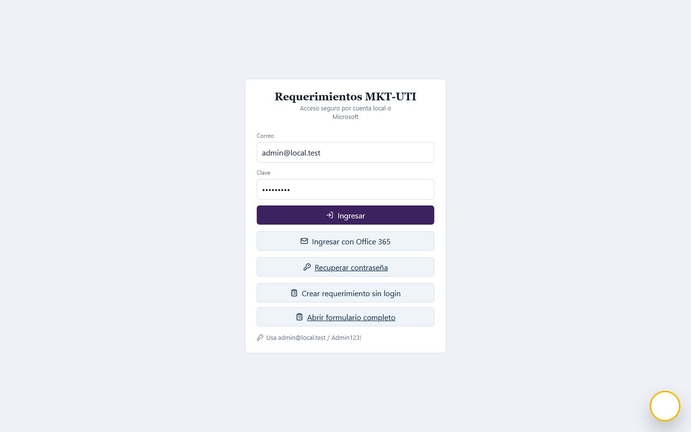
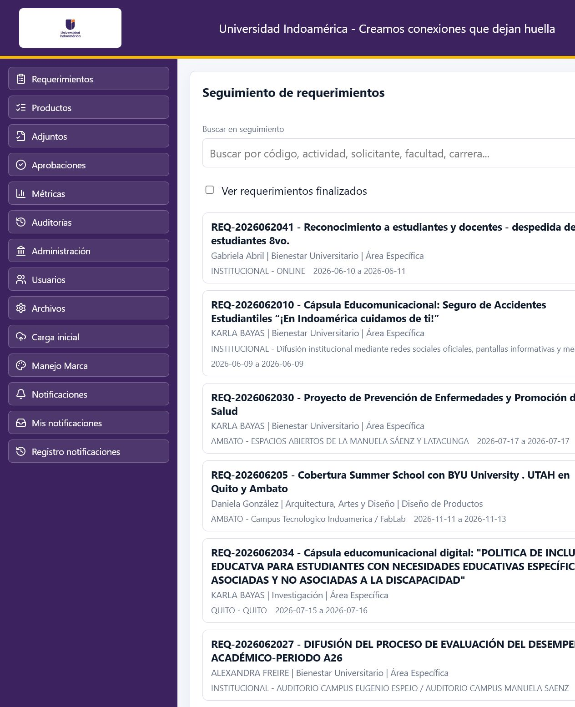
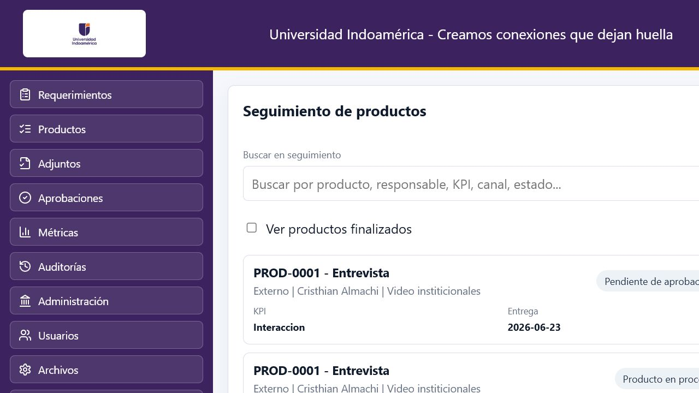
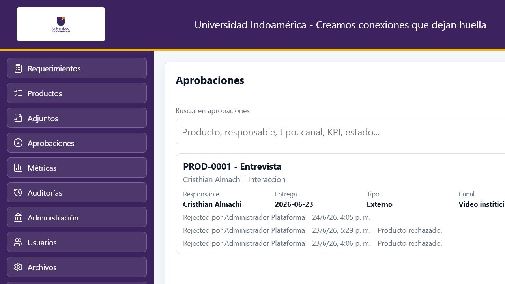
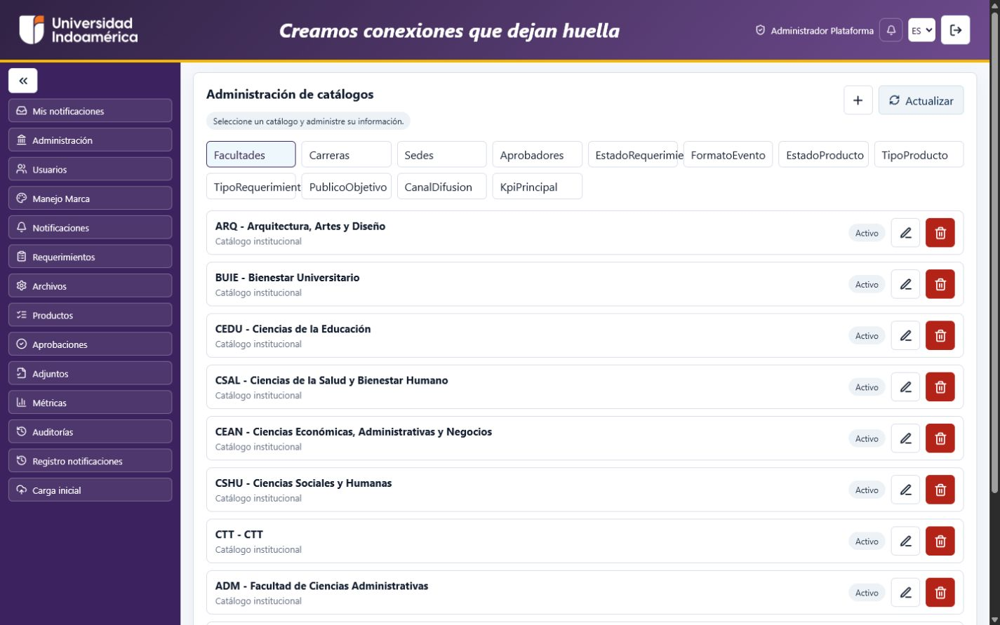
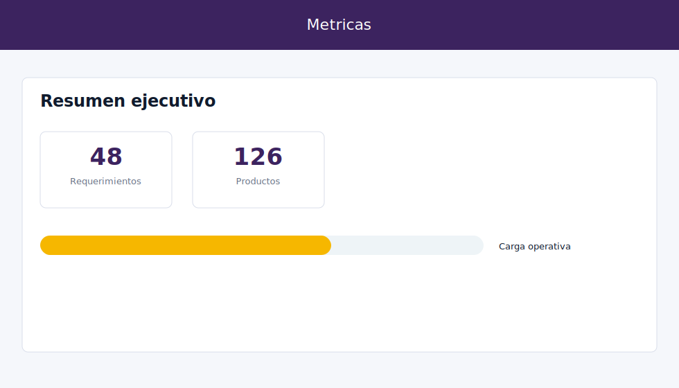
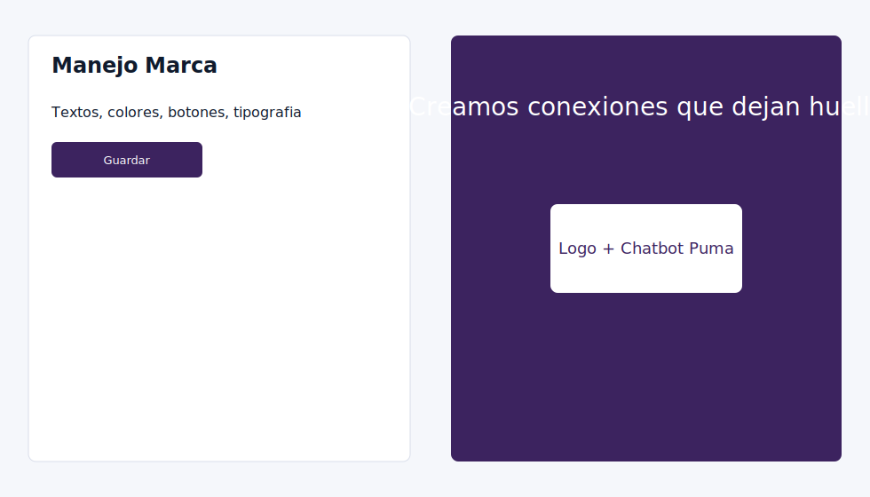
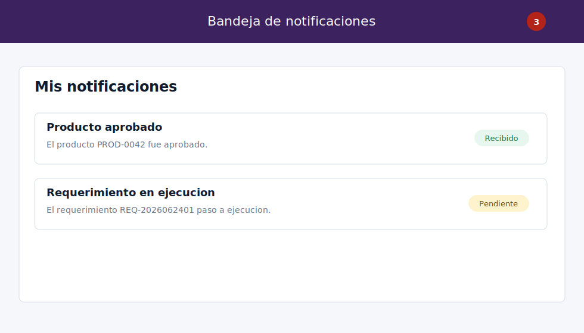

# Requirements Platform

Aplicacion base para recopilar requerimientos, asignar actividades al equipo tecnico, hacer tracking, adjuntar evidencias, aprobar actividades y completar el requerimiento cuando todo este aprobado.

## Documentacion

- [Indice documental](docs/README.md)
- [Arquitectura C4 en 4 niveles](docs/architecture/c4.md)
- [Arquitectura tecnica](docs/technical/technical-architecture.md)
- [Especificacion funcional](docs/functional/functional-specification.md)
- [Manual completo del Administrador](docs/functional/administrator-guide.md)
- [Guia funcional de usuario](docs/functional/user-guide.md)
- [Analytics y Power BI](analytics/README.md)
- [Operaciones y despliegue](docs/operations/deployment.md)
- [Git Flow y ambientes](docs/operations/git-flow.md)
- [Arquitectura frontend del modulo Productos](frontend/features/products/README.md)
- [Cierre tecnico H6 de Productos](codex/H6_PRODUCT_CLOSURE.md)

## Pantallas de ejemplo

Login con acceso local, Office 365, formulario publico y chatbot:



Vista de seguimiento de requerimientos:



Seguimiento de productos:



Aprobaciones con adjuntos:



Administracion de catalogos:



Metricas:



Manejo Marca:



Bandeja y globo de notificaciones:



## Arquitectura

- `backend/src/BuildingBlocks`: dominio compartido y reglas de negocio.
- `backend/src/Services/Requirements/Requirements.Api`: microservicio de requerimientos.
- `backend/src/Services/Activities/Activities.Api`: microservicio de actividades tecnicas.
- `backend/src/Services/Evidence/Evidence.Api`: microservicio de evidencias y aprobaciones.
- `backend/src/Services/Identity/Identity.Api`: login, usuarios, roles, perfiles y token JWT.
- `backend/src/Services/Administration/Administration.Api`: CRUD de facultades, sedes, aprobadores y catalogos.
- `backend/tests/Requirements.UnitTests`: pruebas unitarias del workflow.
- `frontend`: aplicacion Next.js con pantallas independientes por funcion.
- `deploy/nginx.conf`: reverse proxy para despliegue productivo.
- `analytics`: modelo BI, scripts SQL, DAX, Power Query, PBIP/PBIR y documentacion del panel Power BI.

Cada microservicio tiene su propia base logica en SQL Server: `RequirementsDb`, `ActivitiesDb`, `EvidenceDb`, `IdentityDb` y `AdministrationDb`.

## Ejecutar local con Docker

```powershell
docker compose up --build
```

URLs locales:

- Frontend: http://localhost:3000
- Frontend HTTPS con Nginx: https://localhost
- Login con formulario publico y chatbot: https://localhost/login
- Formulario publico directo: https://localhost/public-requirement
- Requirements API Swagger: http://localhost:5101/swagger
- Activities API Swagger: http://localhost:5102/swagger
- Evidence API Swagger: http://localhost:5103/swagger
- Identity API Swagger: http://localhost:5104/swagger
- Administration API Swagger: http://localhost:5105/swagger
- SQL Server: `localhost,14333`, usuario `sa`; usa la clave local configurada en `APPTRAFICOMKT_SQL_PASSWORD`.

Usuario inicial:

- Email: `admin@local.test`
- Password: `Admin123!`
- Roles: `Administrador`, `Aprobador`, `Tecnico`, `Solicitante`

## Ejecutar pruebas

```powershell
dotnet test .\backend\RequirementsPlatform.slnx
```

## HTTPS local con Nginx

Para probar con HTTPS local se incluye un proxy Nginx y un certificado autofirmado para `localhost`.

Generar o regenerar el certificado local:

```powershell
.\deploy\generate-local-cert.ps1
```

Levantar la aplicacion con Nginx HTTPS:

```powershell
docker compose -f docker-compose.yml -f docker-compose.https.yml up --build -d
```

URL:

```txt
https://localhost
```

El certificado local es autofirmado, por eso el navegador mostrara una advertencia de seguridad. Para desarrollo puedes continuar manualmente en el navegador o instalar el certificado `deploy/certs/local/cert.pem` como confiable en tu equipo.

## URL HTTPS externa con Cloudflare Tunnel

Para exponer la aplicacion temporalmente a internet y verla desde Teams:

```powershell
docker compose -f docker-compose.yml -f docker-compose.https.yml -f docker-compose.tunnel.yml up --build
```

En la consola del servicio `cloudflared` aparecera una URL similar a:

```txt
https://xxxx.trycloudflare.com
```

Esa URL es temporal y cambia cada vez que se reinicia el tunel. La ruta local equivalente siempre es:

```txt
https://localhost/login
```

### URL HTTPS fija con Cloudflare Tunnel nombrado

La URL `trycloudflare.com` no es fija. Para tener una URL estable se debe usar un tunel nombrado asociado a una cuenta Cloudflare y a un dominio propio, por ejemplo:

```txt
https://marketingtrafico.indoamerica.edu.ec/login
```

Archivos preparados:

- `docker-compose.tunnel.named.yml`
- `deploy/cloudflared/config.example.yml`

Pasos una sola vez desde una terminal autenticada en Cloudflare:

```powershell
cloudflared tunnel login
cloudflared tunnel create apptraficomkt
cloudflared tunnel route dns apptraficomkt marketingtrafico.indoamerica.edu.ec
```

Luego copiar el archivo de credenciales generado por Cloudflare como:

```txt
deploy/cloudflared/apptraficomkt.json
```

Crear `deploy/cloudflared/config.yml` copiando `deploy/cloudflared/config.example.yml`. El ejemplo ya usa `marketingtrafico.indoamerica.edu.ec`. Levantar con:

```powershell
docker compose -f docker-compose.yml -f docker-compose.https.yml -f docker-compose.tunnel.named.yml up --build -d
```

Con ese esquema la URL no cambia al reiniciar contenedores.

## Flujo funcional

1. Crear requerimiento.
2. Pasarlo a analisis.
3. Pasarlo a ejecucion.
4. Crear actividades tecnicas asociadas.
5. Iniciar actividades.
6. Adjuntar evidencia.
7. Enviar actividad a aprobacion.
8. Aprobar actividad.
9. Completar requerimiento cuando todas sus actividades esten aprobadas.

## Pantallas

- `/login`: acceso con cuenta local y punto preparado para Microsoft Entra ID.
- `/dashboard`: recopilacion y tracking de requerimientos.
- `/activities`: registro y seguimiento de productos.
- `/evidence`: adjuntar archivos de evidencia.
- `/approvals`: aprobaciones para rol aprobador.
- `/audit`: auditorias y tracking administrativo.
- `/admin`: CRUD de facultades, sedes, aprobadores y catalogos.
- `/users`: CRUD inicial de usuarios, roles y perfiles.
- `/storage`: configuracion de carga local, Blob Storage o FTP.
- `/branding`: manejo de marca institucional.
- `/initial-import`: carga inicial con plantillas.
- `/notifications`: configuracion de notificaciones Power Automate.

## Campos principales

Requerimientos:

- ID
- Actividad o evento
- Solicitante
- Facultad
- Carrera
- Sede
- Lugar
- Fecha de inicio
- Fecha de fin
- Objetivo del evento
- Formato del evento
- Estado
- Fecha de solicitud

Productos:

- Id requerimiento
- Id producto
- Tipo requerimiento
- Objetivo estrategico
- Publico objetivo
- Tipo producto
- Canal difusion
- KPI principal
- Responsable producto
- Fecha entrega producto
- Estado
- Observaciones

## Seguridad y permisos

- Login local con JWT.
- Roles base: `Administrador`, `Solicitante`, `Tecnico`, `Aprobador`, `Auditor`.
- Cada usuario puede tener pantallas visibles asignadas desde `/users`.
- Aprobaciones se separaron en `/approvals` y deben asignarse a perfiles con pantalla `approvals`.

## Catalogos parametrizables

Los siguientes catalogos quedan sembrados y se administran desde `/admin` en la pestaña `Catalogos`:

- `EstadoRequerimiento`
- `EstadoProducto`
- `TipoProducto`
- `TipoRequerimiento`
- `PublicoObjetivo`
- `CanalDifusion`
- `KpiPrincipal`

En `/activities`, los campos `Tipo requerimiento`, `Publico objetivo`, `Tipo producto`, `Canal difusion` y `KPI principal` se cargan como listas de seleccion desde esos catalogos.

## Notificaciones Power Automate

Al aprobar un producto, `Activities.Api` puede enviar un webhook a Power Automate con:

- `subject`
- `teamsTitle`
- `html`
- `data`

Configura la URL del flujo:

```powershell
$env:POWER_AUTOMATE_WEBHOOK_URL="https://prod-xx.logic.azure.com/workflows/..."
```

En Docker local tambien puedes editar:

```yaml
Notifications__PowerAutomateWebhookUrl: "https://prod-xx.logic.azure.com/workflows/..."
```

El flujo recomendado en Power Automate:

1. Trigger: `When an HTTP request is received`.
2. Accion: `Send an email (V2)` usando el campo `html`.
3. Accion: `Post message in a chat or channel` usando `teamsTitle` y `html`.

## Carga de archivos

La configuracion inicial usa almacenamiento local:

- Provider: `Local`
- Ruta del contenedor: `/app/uploads`
- Volumen Docker: `evidence-uploads`

La pantalla `/storage` permite configurar:

- Local
- Blob Storage
- FTP

El endpoint de carga es:

```txt
POST /api/evidence/upload
multipart/form-data: activityId, uploadedBy, file
```

Para produccion, configura provider `Blob` y completa `BlobConnectionString` y `BlobContainer`.

## Repositorio GitHub y Git Flow

Repositorio:

```txt
https://github.com/christyepez/appTraficoMKT
```

Ramas:

- `develop`: desarrollo.
- `test`: pruebas.
- `main`: produccion.

Los pipelines se encuentran en `.github/workflows` y estan documentados en [Git Flow y ambientes](docs/operations/git-flow.md).

## Produccion con Nginx

Configura las cadenas de conexion como variables de entorno y levanta el compose productivo:

```powershell
$env:REQUIREMENTS_DB="Server=sqlserver-prod;Database=RequirementsDb;User Id=app;Password=***;TrustServerCertificate=True"
$env:ACTIVITIES_DB="Server=sqlserver-prod;Database=ActivitiesDb;User Id=app;Password=***;TrustServerCertificate=True"
$env:EVIDENCE_DB="Server=sqlserver-prod;Database=EvidenceDb;User Id=app;Password=***;TrustServerCertificate=True"
$env:IDENTITY_DB="Server=sqlserver-prod;Database=IdentityDb;User Id=app;Password=***;TrustServerCertificate=True"
$env:ADMINISTRATION_DB="Server=sqlserver-prod;Database=AdministrationDb;User Id=app;Password=***;TrustServerCertificate=True"
$env:JWT_ISSUER="RequirementsPlatform"
$env:JWT_AUDIENCE="RequirementsPlatformWeb"
$env:JWT_SECRET="change-this-secret-in-production"
$env:AZURE_AD_TENANT_ID="tenant-id"
$env:AZURE_AD_CLIENT_ID="client-id"
$env:NGINX_CERTS_PATH="C:\certs\requirements-platform"
docker compose -f docker-compose.prod.yml up --build -d
```

La carpeta indicada en `NGINX_CERTS_PATH` debe contener:

- `fullchain.pem`
- `privkey.pem`

Ejemplo con certificados emitidos por Let's Encrypt o por tu proveedor SSL:

```txt
C:\certs\requirements-platform\fullchain.pem
C:\certs\requirements-platform\privkey.pem
```

El compose productivo expone:

- `80`: redirecciona a HTTPS
- `443`: HTTPS con Nginx

Archivos de despliegue:

- `deploy/nginx.local-https.conf`: HTTPS local con certificado autofirmado.
- `deploy/nginx.prod-https.conf`: HTTPS productivo con certificados reales.
- `docker-compose.https.yml`: override local para `https://localhost`.
- `docker-compose.prod.yml`: compose productivo preparado para HTTPS.

Para produccion real conviene reemplazar `EnsureCreated` por migraciones EF Core versionadas y manejar secretos con el proveedor de la nube o Docker secrets.
