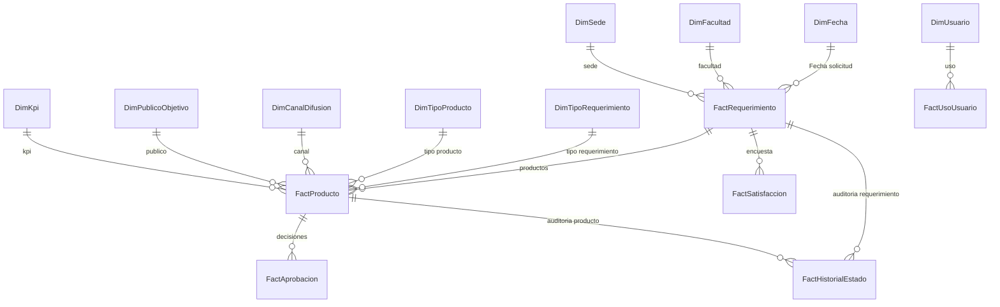

# Diagrama del modelo BI

## Relacionamiento

- `FactProducto.RequerimientoId` -> `FactRequerimiento.RequerimientoId`.
- `FactAprobacion.ProductoId` -> `FactProducto.ProductoId`.
- `FactSatisfaccion.RequerimientoId` -> `FactRequerimiento.RequerimientoId`.
- `FactRequerimiento.FacultadId` -> `DimFacultad.FacultadId`.
- `FactRequerimiento.SedeId` -> `DimSede.SedeId`.
- `FactProducto.TipoProductoId` -> `DimTipoProducto.TipoProductoId`.

Evitar muchos a muchos. Si se formalizan aprobadores multiples por version, crear tabla puente o hecho granular `Producto-Version-Aprobador`.
