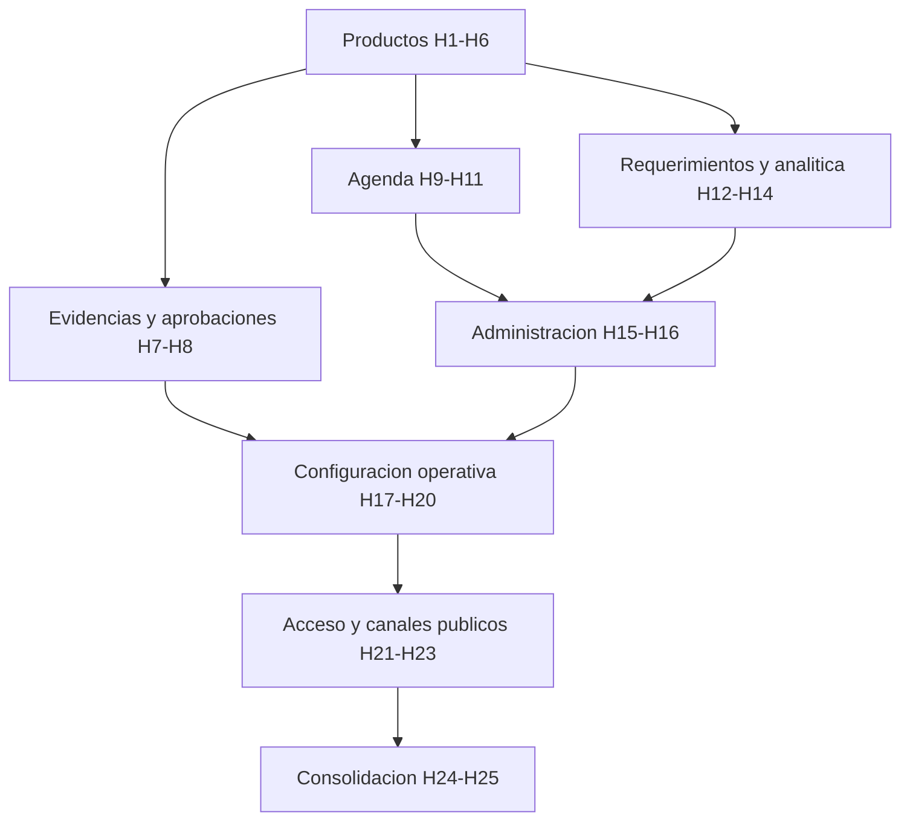

# Roadmap maestro de refactorizacion frontend

## Objetivo

Refactorizar todo el frontend de `appTraficoMKT` de forma incremental, ordenada
y verificable, manteniendo la aplicacion aislada de `PortalCorporativo`.

## Reglas de ejecucion

- Rama inicial: `feature1.0`.
- Un hito por ejecucion y uno o mas commits pequenos, compilables y revisables.
- No iniciar un hito sin aprobar el anterior.
- No cambiar contratos backend dentro de una refactorizacion frontend.
- Mantener Next.js 16, React 19, TypeScript y `fetch`.
- React Hook Form + Zod para formularios refactorizados.
- Vitest + Testing Library para pruebas.
- CSS global solo para tokens y patrones compartidos; CSS Modules para estilos locales.
- `CodexCommonAgents` gobierna alcance, arquitectura y calidad.
- `PortalCorporativo` permanece fuera de alcance.

## Orden maestro

| Fase | Hitos | Modulos | Dependencia principal |
|---|---:|---|---|
| 0. Gobierno | H0 | Contratos, estrategia, pruebas base | Ninguna |
| 1. Productos | H1-H6 | Products/Activities | H0 |
| 2. Flujo documental | H7-H8 | Evidence, Approvals | H6 |
| 3. Planificacion | H9-H11 | Agenda, Calendar, Agenda Metrics | H6 |
| 4. Requerimientos y analitica | H12-H14 | Dashboard, Metrics, Audit | H6 |
| 5. Administracion | H15-H16 | Admin, Users | H6 y componentes shared validados |
| 6. Configuracion operativa | H17-H20 | Branding, Notifications, Storage, Initial Import | H15-H16 |
| 7. Acceso y canales externos | H21-H23 | Login/Auth, Public Requirement, Satisfaction | H16-H20 |
| 8. Consolidacion | H24-H25 | Navigation/Layout, shared/core y regresion | Todos los anteriores |

## Hitos completos

| Hito | Resultado | Prompt |
|---|---|---|
| H0 | Estrategia y linea base aprobadas | `PROMPTS.md` Prompt 0 |
| H1-H6 | Productos modularizado y estabilizado | `PROMPTS.md` Prompts 1-6 |
| H7 | Evidencias desacopladas | `prompts/02-evidence-approvals.md` Prompt H7 |
| H8 | Aprobaciones desacopladas | `prompts/02-evidence-approvals.md` Prompt H8 |
| H9 | Agenda tecnica desacoplada | `prompts/03-agenda.md` Prompt H9 |
| H10 | Calendario tecnico desacoplado | `prompts/03-agenda.md` Prompt H10 |
| H11 | Metricas de agenda desacopladas | `prompts/03-agenda.md` Prompt H11 |
| H12 | Requerimientos/Dashboard desacoplado | `prompts/04-requirements-analytics.md` Prompt H12 |
| H13 | Metricas generales desacopladas | `prompts/04-requirements-analytics.md` Prompt H13 |
| H14 | Auditoria desacoplada | `prompts/04-requirements-analytics.md` Prompt H14 |
| H15 | Catalogos y administracion desacoplados | `prompts/05-administration.md` Prompt H15 |
| H16 | Usuarios y permisos visibles desacoplados | `prompts/05-administration.md` Prompt H16 |
| H17 | Marca y tema desacoplados | `prompts/06-operations.md` Prompt H17 |
| H18 | Notificaciones y bitacoras desacopladas | `prompts/06-operations.md` Prompt H18 |
| H19 | Almacenamiento desacoplado | `prompts/06-operations.md` Prompt H19 |
| H20 | Carga inicial desacoplada | `prompts/06-operations.md` Prompt H20 |
| H21 | Login y recuperacion desacoplados | `prompts/07-access-public.md` Prompt H21 |
| H22 | Formulario publico desacoplado | `prompts/07-access-public.md` Prompt H22 |
| H23 | Satisfaccion publica desacoplada | `prompts/07-access-public.md` Prompt H23 |
| H24 | Navegacion, layout y CSS global consolidados | `prompts/08-consolidation.md` Prompt H24 |
| H25 | Regresion integral y cierre de `feature1.0` | `prompts/08-consolidation.md` Prompt H25 |

## Dependencias entre modulos



## Puertas de calidad

Cada hito debe cumplir:

1. Alcance y archivos permitidos declarados antes de modificar.
2. Sin dependencias con `PortalCorporativo`.
3. Sin cambios backend no autorizados.
4. Sin `fetch` directo en componentes de presentacion.
5. Reglas puras y componentes criticos probados.
6. `pnpm test` y `pnpm build` verdes.
7. Diff revisado y commit acotado.
8. `codex/TASKS.md` actualizado.
9. Detencion antes del siguiente hito.
10. Cobertura minima del 80% sobre codigo nuevo de reglas, servicios y hooks.

## Estrategia de ramas

Mientras se construye la version 1.0, los hitos pueden vivir en `feature1.0` con
commits independientes. Si varios desarrolladores trabajan en paralelo, crear
ramas hijas desde `feature1.0`, por ejemplo:

```text
feature1.0/products-h2
feature1.0/evidence-h7
feature1.0/agenda-h9
```

Cada rama hija debe regresar mediante PR a `feature1.0`; `main` se actualiza solo
despues de H25 y de una autorizacion explicita.
