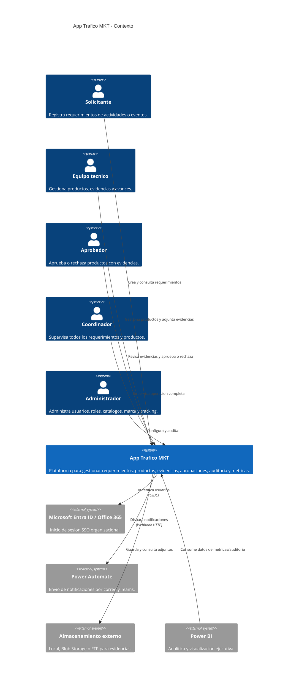
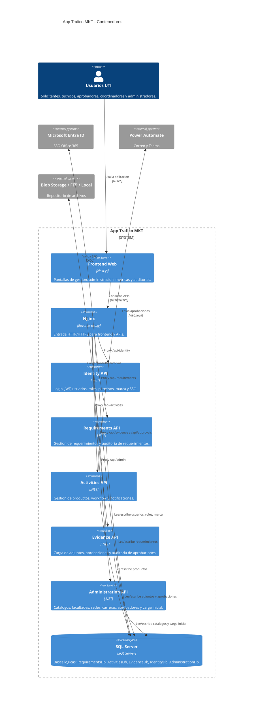
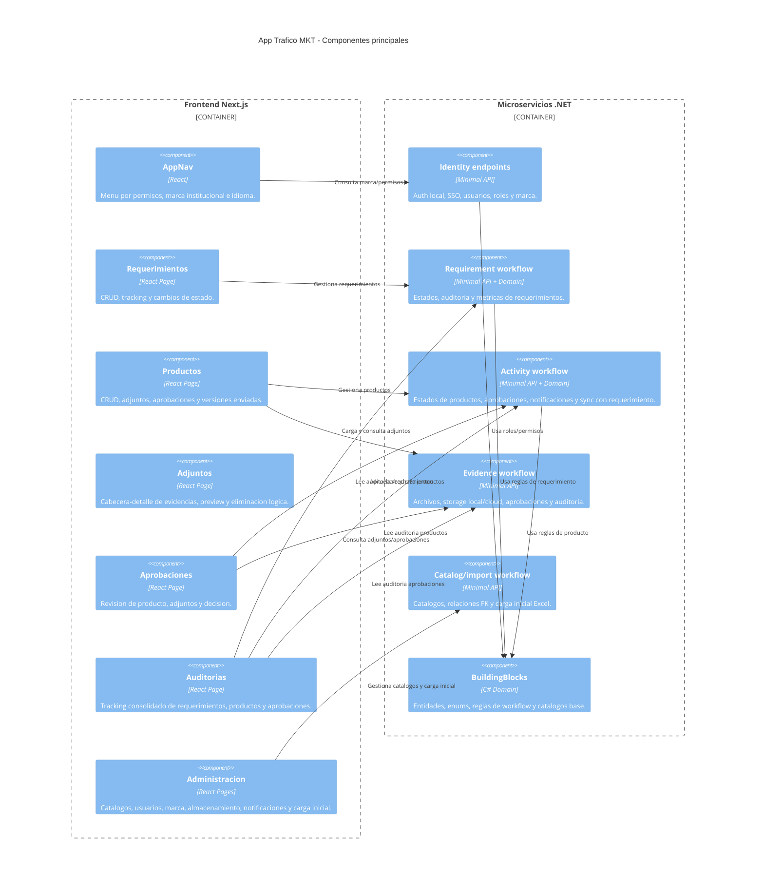
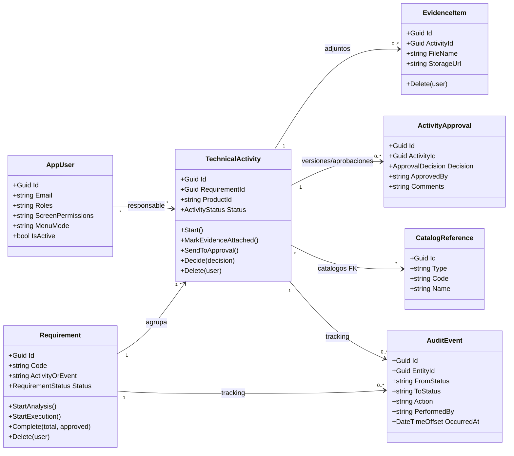
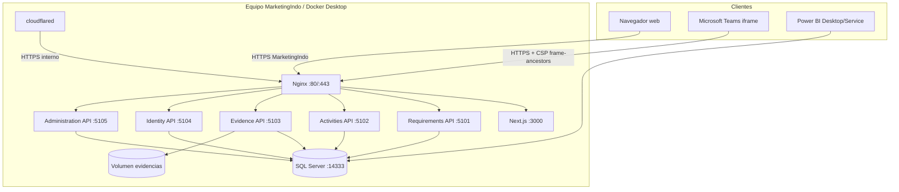
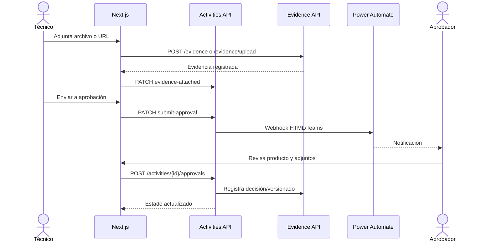

# Arquitectura C4

Este documento describe la aplicacion en 4 niveles C4: contexto, contenedores, componentes y codigo.

## Nivel 1: Contexto

## Nivel 2: Contenedores

## Nivel 3: Componentes

## Nivel 4: Codigo

## Vista de despliegue

Entradas soportadas:

- `https://MarketingIndo`: nombre principal de red interna.
- `https://DESKTOP-Q1VCG41`: nombre secundario.
- `https://localhost`: administración desde el servidor.
- `https://marketingtrafico.indoamerica.edu.ec`: hostname previsto para túnel nombrado.

## Secuencia de aprobación

## Límites de responsabilidad

| Límite | Propietario | Datos principales |
| --- | --- | --- |
| Identidad | Identity API | Usuarios, roles, permisos, marca, sesión y SSO. |
| Requerimientos | Requirements API | Solicitud, estados y auditoría del requerimiento. |
| Productos | Activities API | Asignación, workflow, notificaciones y auditoría del producto. |
| Evidencias | Evidence API | Adjuntos, storage, decisiones y auditoría de aprobación. |
| Parametrización | Administration API | Catálogos, relaciones y cargas iniciales. |

## Decisiones arquitectónicas

1. Cada microservicio conserva su base lógica para reducir acoplamiento de escritura.
2. Nginx actúa como único punto de entrada y resuelve dinámicamente los servicios Docker.
3. Las eliminaciones son lógicas para preservar integridad y trazabilidad.
4. Los catálogos principales se relacionan mediante FK y no por texto libre.
5. Los archivos se abstraen mediante proveedor Local, Blob o FTP.
6. Los eventos de auditoría conservan estado, usuario, fecha y JSON de contexto.
7. `restart: unless-stopped` mantiene los contenedores disponibles mientras Docker Desktop esté iniciado.
8. La política CSP permite integrar la aplicación como iframe de Microsoft Teams y Microsoft 365.

