# Manual completo del Administrador

Este documento describe las responsabilidades, pantallas y procedimientos disponibles para el rol `Administrador` de App Tráfico MKT.

## 1. Responsabilidades

El Administrador puede:

- Consultar todos los requerimientos, productos, adjuntos y aprobaciones.
- Gestionar usuarios, roles, permisos y acceso Office 365.
- Mantener facultades, carreras, sedes, aprobadores y catálogos.
- Parametrizar marca, cabecera, menú y opciones públicas del login.
- Configurar almacenamiento Local, Blob o FTP.
- Configurar Power Automate, correo, Teams y plantillas HTML.
- Ejecutar cargas iniciales por plantilla.
- Consultar auditoría, métricas y registro de notificaciones.
- Aplicar eliminación lógica conservando trazabilidad.

## 2. Acceso del Administrador

1. Abra la URL del ambiente.
2. Ingrese la cuenta administrativa local o use Office 365 si está habilitado.
3. Verifique que la cabecera muestre el nombre del usuario.
4. El Administrador inicia en `Requerimientos` y visualiza todas las opciones.

La visibilidad del botón Office 365, formularios públicos, robot y credenciales de prueba se controla globalmente desde Manejo Marca.

## 3. Menú administrativo

| Opción | Ruta | Finalidad |
| --- | --- | --- |
| Requerimientos | `/dashboard` | Supervisar solicitudes y estados. |
| Productos | `/activities` | Supervisar entregables y responsables. |
| Adjuntos | `/evidence` | Revisar evidencias agrupadas por producto. |
| Aprobaciones | `/approvals` | Consultar pendientes y decisiones. |
| Métricas | `/metrics` | Analizar operación, tiempos y uso. |
| Auditorías | `/audit` | Reconstruir eventos del sistema. |
| Administración | `/admin` | Mantener catálogos. |
| Usuarios | `/users` | Gestionar seguridad y perfiles. |
| Archivos | `/storage` | Configurar almacenamiento. |
| Carga inicial | `/initial-import` | Importar información estructurada. |
| Manejo Marca | `/branding` | Configurar look & feel y login. |
| Notificaciones | `/notifications` | Configurar Power Automate y plantillas. |
| Mis notificaciones | `/my-notifications` | Consultar mensajes propios. |
| Registro notificaciones | `/notification-log` | Auditar mensajes enviados. |

## 4. Administración de requerimientos

El Administrador ve todos los requerimientos, independientemente del solicitante o técnico asignado.

### Crear

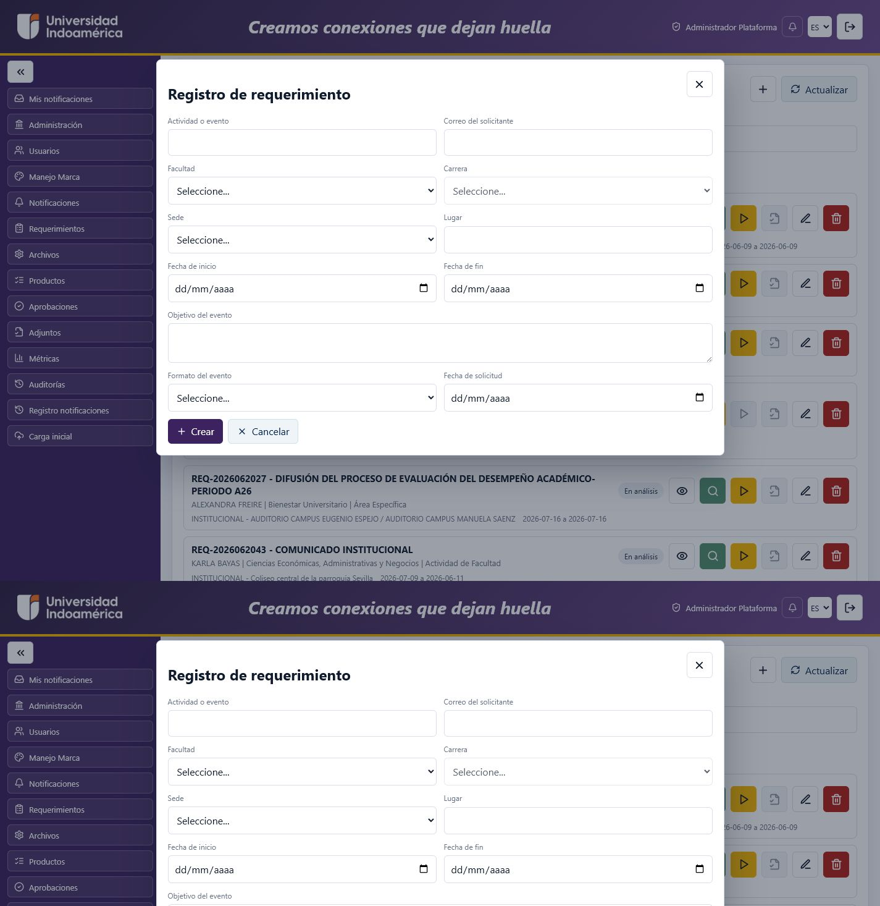

1. Presione `+`.
2. Registre actividad, solicitante, facultad, carrera, sede, lugar y fechas.
3. Registre el objetivo y formato.
4. Guarde y confirme que el popup se cierre.
5. Verifique que el registro aparezca sin usar `Actualizar`.

### Controlar estados

- `Borrador`: solicitud registrada.
- `En análisis`: existe revisión o producto relacionado.
- `En ejecución`: al menos un producto está en progreso.
- `Completado`: todos los productos están aprobados.
- `Finalizado rechazado`: eliminación lógica o cierre rechazado.

### Acciones administrativas

- Buscar y resaltar coincidencias.
- Cambiar estado cuando el workflow lo permita.
- Editar información general.
- Eliminar lógicamente requerimiento y productos.
- Consultar finalizados mediante el check dedicado.

## 5. Administración de productos

### Crear y asignar

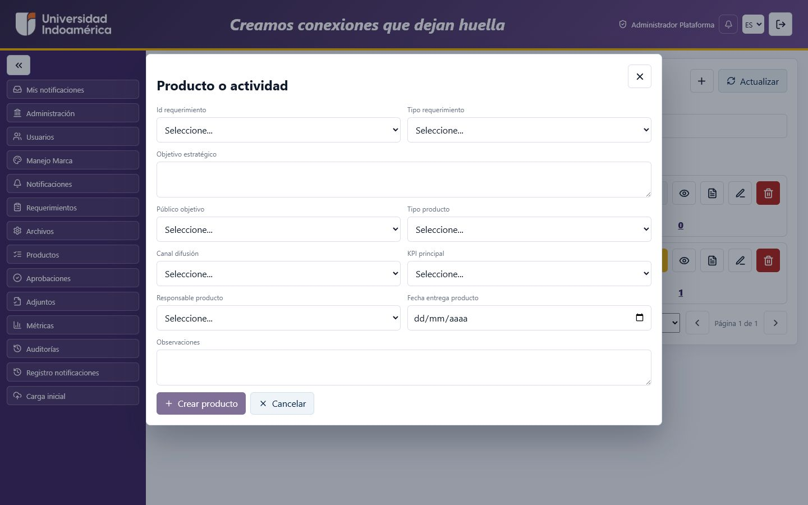

1. Seleccione el requerimiento padre.
2. Verifique el secuencial sugerido `PROD-####`.
3. Complete todos los catálogos obligatorios.
4. Asigne un usuario activo con rol Técnico.
5. Registre entrega y observaciones.
6. Guarde y confirme la actualización automática del grid.

### Supervisar workflow

Las acciones deben ejecutarse en orden:

1. Iniciar producto.
2. Adjuntar evidencia.
3. Enviar a aprobación.
4. Aprobar o rechazar.
5. Corregir y reenviar cuando sea rechazado.

El Administrador ve todos los productos. Por defecto se ocultan aprobados; el check cambia la vista a finalizados.

### Revisar versiones

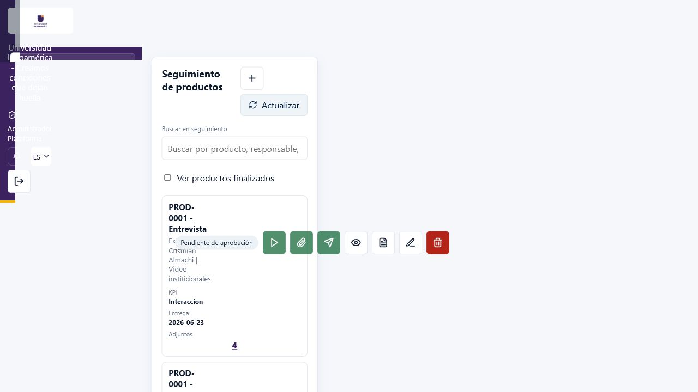

Cada envío conserva decisión, fecha, aprobador, comentarios y relación con adjuntos. No deben eliminarse versiones previas al corregir.

## 6. Administración de adjuntos

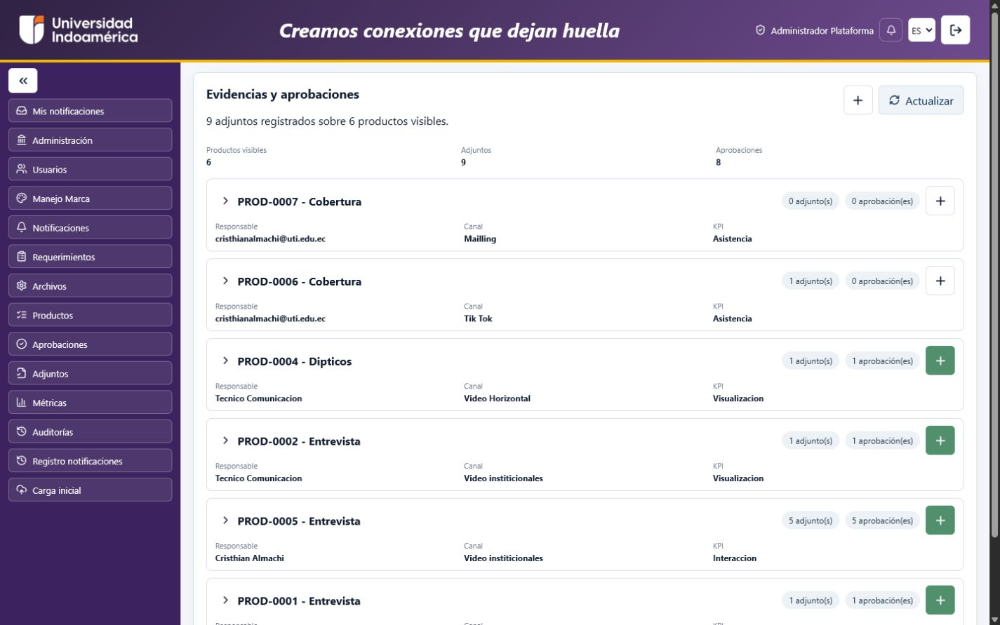

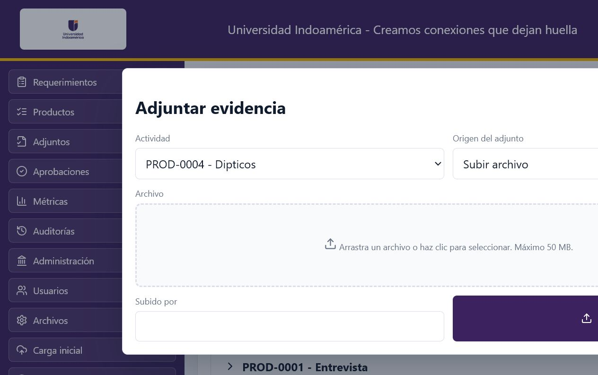

El Administrador puede:

- Subir archivos de hasta 50 MB.
- Registrar URL para contenidos pesados.
- Consultar adjuntos agrupados y colapsados por producto.
- Abrir imágenes, PDF y enlaces.
- Eliminar lógicamente una evidencia con confirmación.

Antes de eliminar, verifique si la evidencia pertenece a una versión ya enviada a aprobación.

## 7. Supervisión de aprobaciones

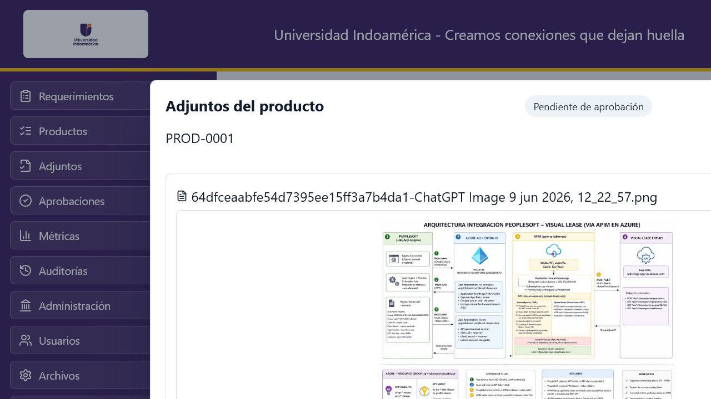

El Administrador puede consultar toda la bandeja, pero la operación ordinaria corresponde al Aprobador.

Validaciones recomendadas:

- Producto, responsable y fecha de entrega.
- Evidencia disponible y legible.
- Historial de decisiones.
- Comentario obligatorio y claro al rechazar.
- Estado del requerimiento después de la decisión.

## 8. Métricas administrativas

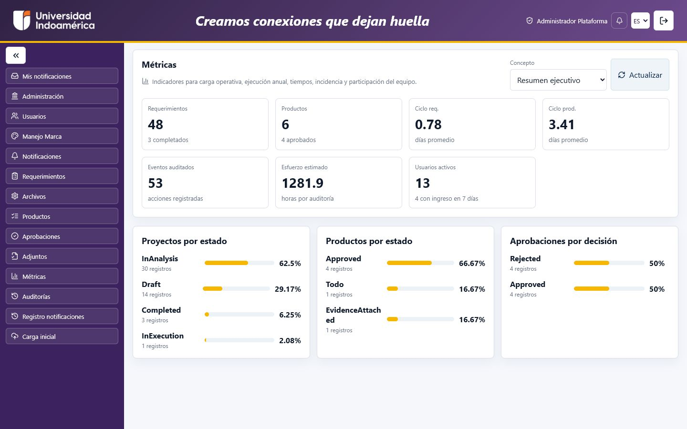

Utilice el selector de concepto para analizar:

- Carga operativa por responsable.
- Cantidad de proyectos ejecutados.
- Tiempo promedio y esfuerzo.
- Incidencia institucional.
- Participación por áreas.
- Usabilidad por usuario y actividad.

Las métricas deben interpretarse junto con auditoría para diferenciar carga asignada, actividad real y tiempos de aprobación.

## 9. Auditoría y tracking

1. Seleccione Requerimientos, Productos o Aprobaciones.
2. Busque por usuario, acción, estado o decisión.
3. Revise fecha, estado anterior/posterior y descripción.
4. Abra el JSON técnico para soporte o investigación.

La auditoría no debe editarse desde la interfaz. Su función es reconstruir quién hizo qué, cuándo y sobre cuál entidad.

## 10. Catálogos y parametrizaciones

### Catálogos disponibles

- Facultades.
- Carreras relacionadas con facultades.
- Sedes.
- Aprobadores.
- EstadoRequerimiento.
- FormatoEvento.
- EstadoProducto.
- TipoProducto.
- TipoRequerimiento.
- PublicoObjetivo.
- CanalDifusion.
- KpiPrincipal.

### Crear o editar

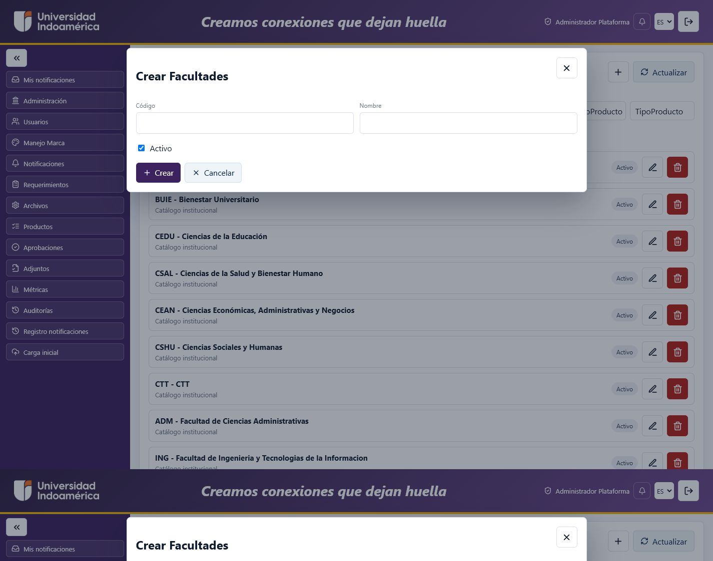

1. Seleccione el catálogo horizontal.
2. Revise primero sus registros.
3. Presione `+` para crear o el lápiz para editar.
4. Mantenga códigos únicos y nombres descriptivos.
5. Use inactivación lógica si el registro ya está relacionado.

Reglas:

- No reutilice códigos con significados diferentes.
- No cree carreras sin facultad.
- No elimine físicamente estados usados históricamente.
- Verifique combos de requerimientos y productos después de modificar catálogos.

## 11. Usuarios, roles y permisos

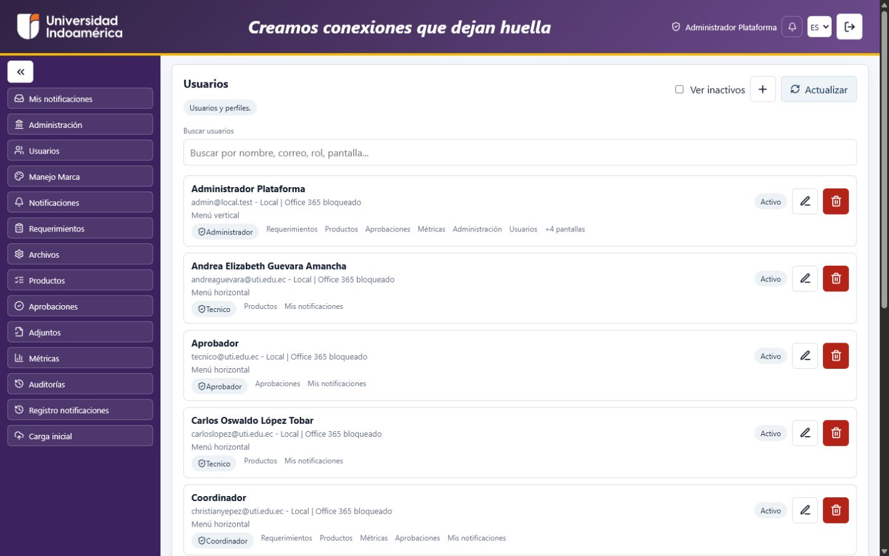

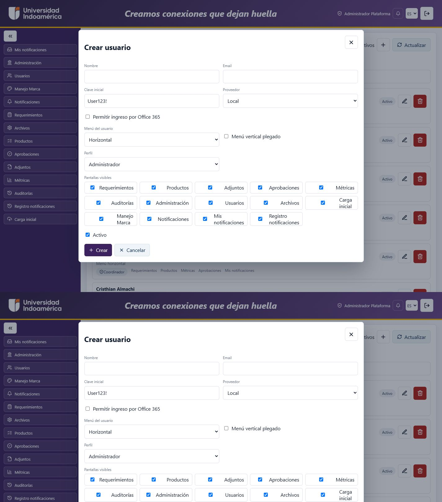

### Crear usuario

1. Registre nombre y correo válido.
2. Defina contraseña local cuando corresponda.
3. Asigne roles.
4. Revise y ajuste pantallas visibles.
5. Active Office 365 solamente para cuentas organizacionales autorizadas.
6. Defina menú horizontal o vertical.
7. Guarde y pruebe el acceso con el perfil.

### Roles

- `Administrador`: acceso total.
- `Coordinador`: supervisión integral de operación.
- `Tecnico`: productos asignados y adjuntos.
- `Aprobador`: bandeja de aprobación.
- `Auditor`: métricas y tracking.
- `Solicitante`: requerimientos relacionados.

### Inactivar

- El check `Ver inactivos` muestra únicamente usuarios inactivos.
- No se permite inactivar usuarios con asignaciones activas.
- Reasigne requerimientos/productos antes de inactivar.
- La contraseña visible es información sensible y debe manejarse únicamente por Administrador.

## 12. Configuración de almacenamiento

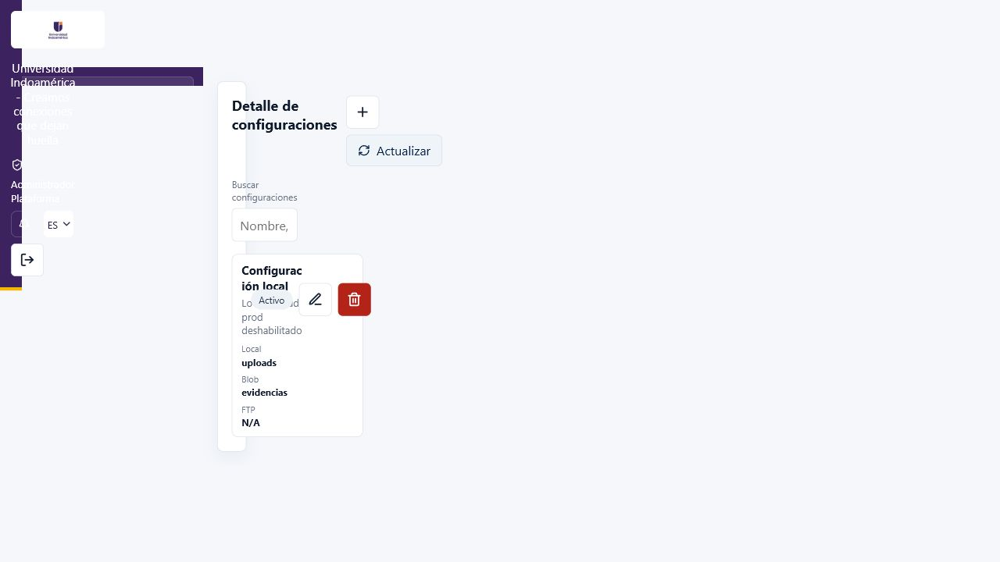

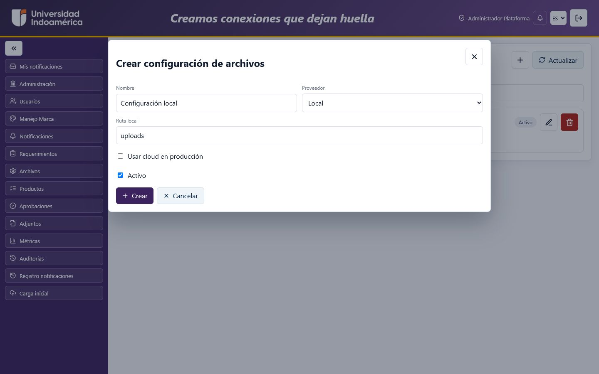

| Proveedor | Parámetros | Uso |
| --- | --- | --- |
| Local | Ruta local | Desarrollo o instalación interna. |
| Blob | Connection string y container | Producción cloud. |
| FTP | Host, usuario y contraseña | Repositorio externo existente. |

Mantenga una configuración activa coherente con el ambiente. No publique credenciales en Git ni en documentación.

## 13. Carga inicial

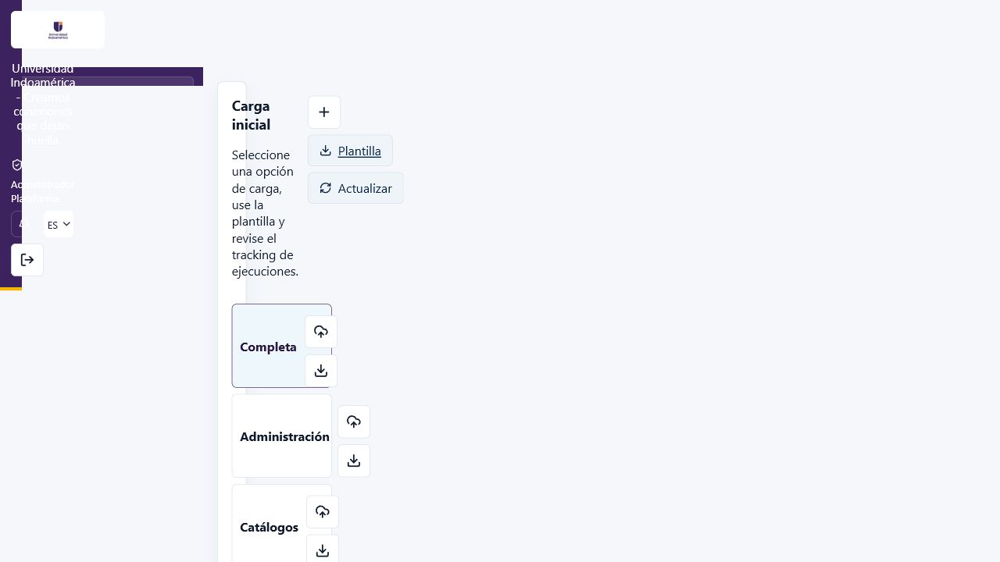

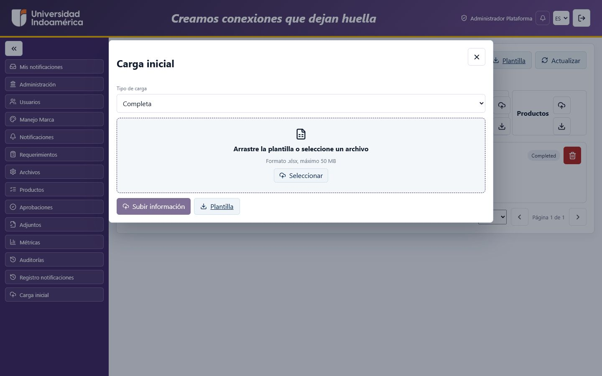

Opciones:

- Completa.
- Administración.
- Catálogos.
- Usuarios.
- Requerimientos.
- Productos.

Procedimiento:

1. Descargue la plantilla específica.
2. No cambie hojas ni encabezados.
3. Complete códigos y relaciones antes de los datos dependientes.
4. Seleccione o arrastre el `.xlsx`.
5. Ejecute la carga.
6. Revise tracking, fechas, cantidades y estado.
7. Corrija el archivo y vuelva a cargar si existen errores.

Orden recomendado: administración, catálogos, usuarios, requerimientos y productos.

## 14. Manejo Marca

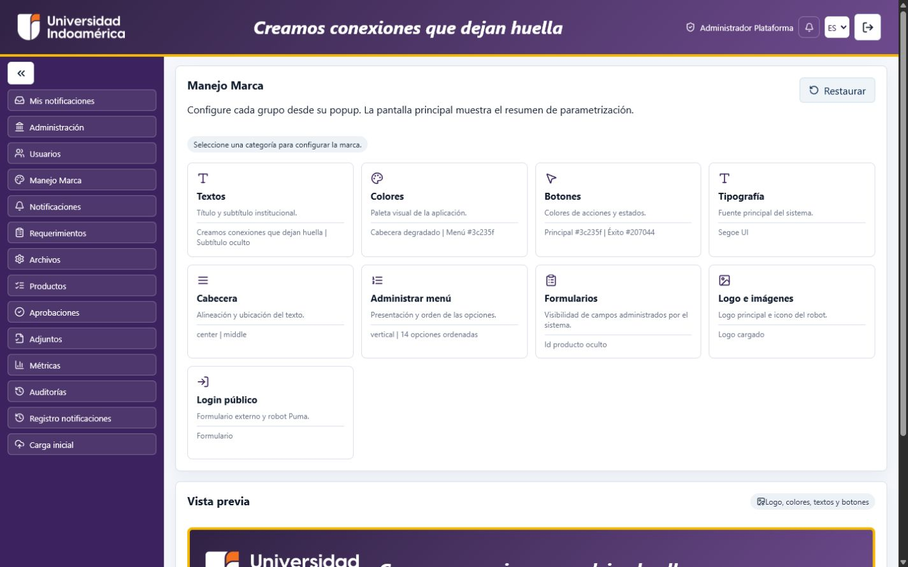

Categorías:

- Textos: título y subtítulo.
- Colores: superficie, fondo, texto y líneas.
- Botones: principal, secundario y estados.
- Tipografía: fuente global.
- Cabecera y menú: alineación, orientación y plegado.
- Navegación móvil: menú lateral plegado o abierto por defecto.
- Logo e imágenes: identidad institucional y robot.
- Login público: opciones visibles antes de autenticarse.

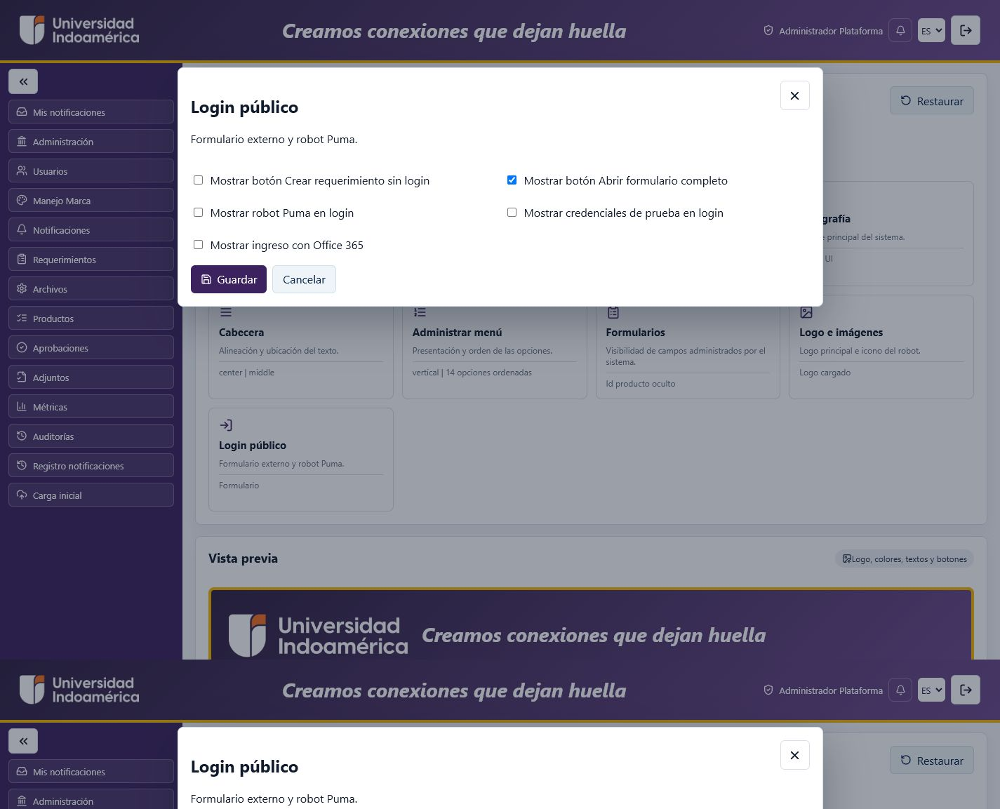

Los checks de login son independientes:

- Crear requerimiento sin login.
- Abrir formulario completo.
- Robot Puma.
- Credenciales de prueba.
- Ingreso con Office 365.

Los cambios son globales. Verifique login, escritorio y móvil después de guardar.

## 15. Notificaciones y Power Automate

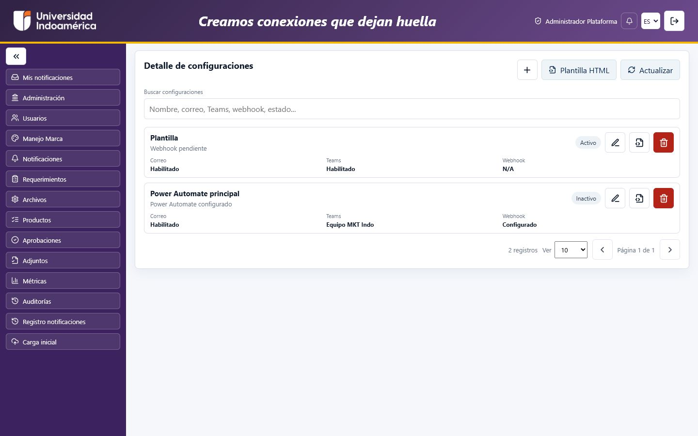

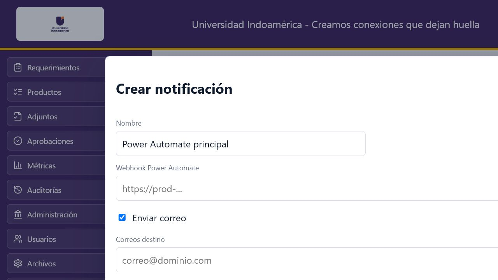

1. Registre nombre de configuración.
2. Ingrese webhook HTTPS de Power Automate.
3. Active correo y/o Teams.
4. Configure destinatarios y canal.
5. Edite la plantilla HTML.
6. Revise el preview antes de guardar.
7. Active la configuración.

Eventos esperados:

- Creación de requerimiento.
- Inicio de ejecución.
- Envío de producto a aprobación.
- Aprobación/rechazo.
- Producto aprobado con adjunto.

## 16. Bandejas de notificaciones

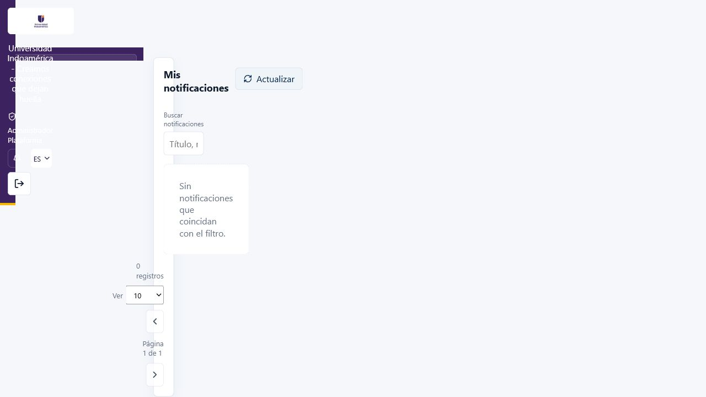

El Administrador también recibe notificaciones según permisos y puede marcarlas como recibidas.

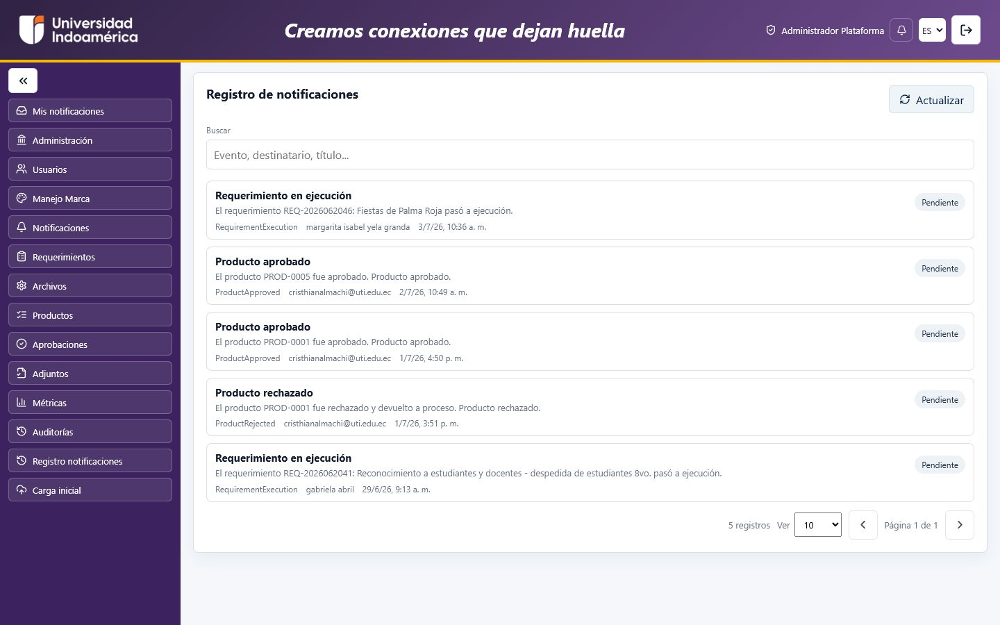

El registro administrativo permite verificar evento, destinatario, mensaje, fecha, origen y confirmación de recibido.

## 17. Captura pública

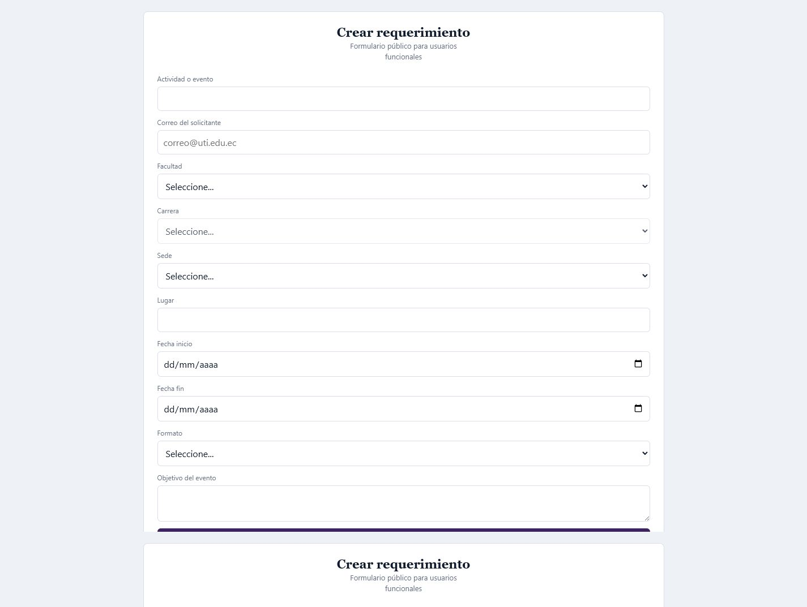

El Administrador debe mantener activos los catálogos usados por el formulario público y verificar que la carrera dependa de la facultad.

## 18. Recuperación de acceso

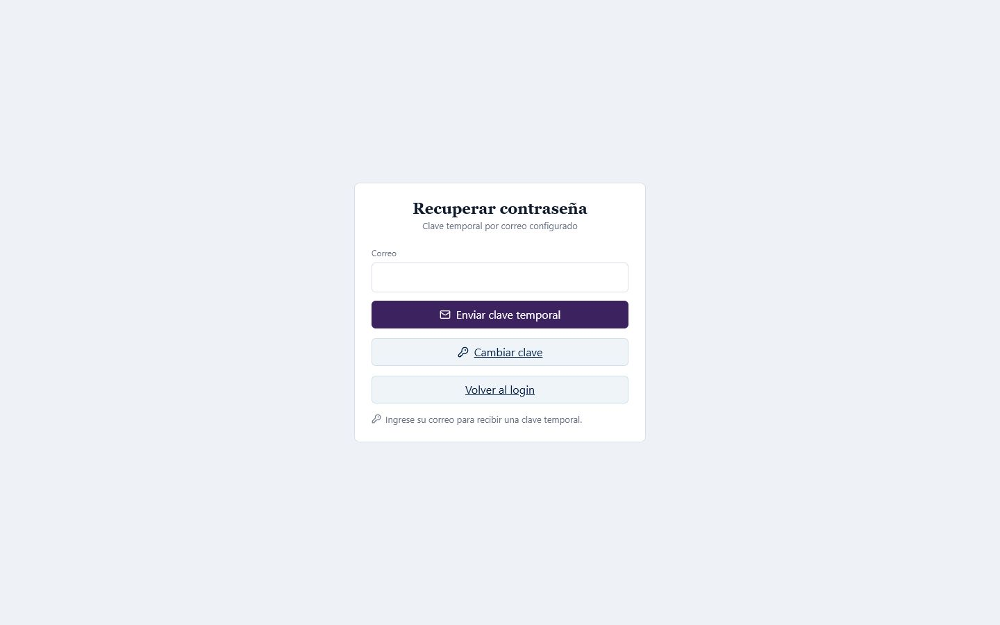

La recuperación genera una clave temporal y usa la configuración de notificaciones. Después del cambio, el usuario vuelve automáticamente al login.

## 19. Checklist diario

1. Revisar requerimientos nuevos.
2. Revisar productos sin responsable o vencidos.
3. Revisar aprobaciones pendientes.
4. Revisar fallas de notificación.
5. Revisar cargas iniciales recientes.
6. Verificar usuarios bloqueados/inactivos.
7. Consultar auditoría ante acciones inesperadas.

## 20. Checklist de mantenimiento

- Verificar salud de contenedores y APIs.
- Confirmar backup de SQL Server.
- Confirmar backup de evidencias locales o Blob.
- Revisar expiración de secretos Microsoft y Power Automate.
- Revisar espacio de disco.
- Mantener DNS/certificado de `MarketingIndo` y dominio productivo.
- Probar login local y Office 365 después de cambios de seguridad.
- No almacenar tokens, contraseñas o connection strings en Git.

## 21. Diagnóstico rápido

| Síntoma | Revisión |
| --- | --- |
| Login 401 | Usuario activo, contraseña, token y hora del equipo. |
| Ruta 404 | Nginx, contenedor y prefijo `/api`. |
| No aparece menú | Roles y pantallas visibles del usuario. |
| No aparece técnico | Usuario activo con rol `Tecnico`. |
| No se envía aprobación | Evidencia, estado y configuración Power Automate. |
| No abre adjunto | Provider activo, URL/ruta y permisos. |
| Teams no carga | DNS, certificado confiable, CSP y política Teams. |
| Datos no refrescan | API saludable, sesión vigente y consola del navegador. |

## 22. Uso desde dispositivos móviles

La aplicación detecta el ancho disponible y adapta únicamente la presentación. Los permisos, filtros, validaciones y flujos son los mismos que en escritorio.

### 22.1 Navegación

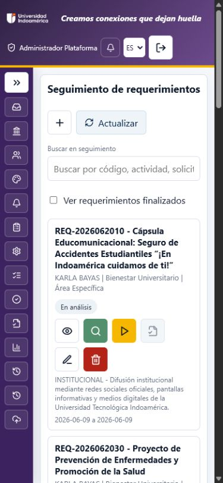

- La cabecera permanece visible al inicio y reduce el tamaño de logo, título y controles de sesión.
- El menú se ubica a la izquierda como una barra de iconos plegada.
- El botón de menú de la cabecera abre el drawer lateral con iconos y etiquetas.
- El contenido reserva el ancho de la barra plegada y no presenta desplazamiento horizontal.
- En pantallas muy estrechas, las categorías y formularios cambian a una columna.

### 22.2 Seguimiento de productos

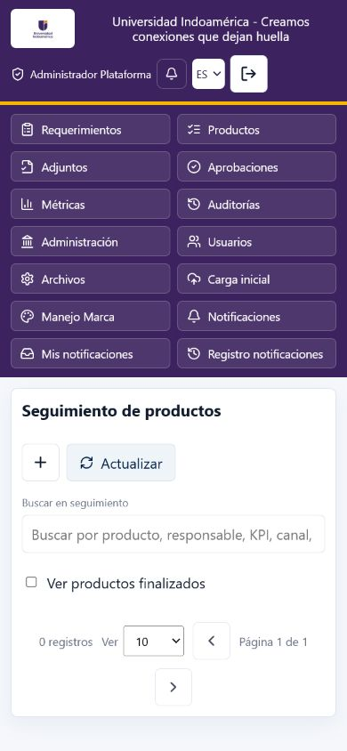

Las acciones conservan su secuencia funcional. Los botones se distribuyen en varias líneas cuando el ancho no permite mostrarlos juntos y cada registro mantiene visible su estado.

### 22.3 Administración de usuarios

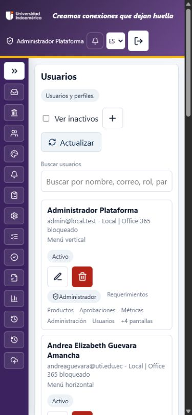

La búsqueda, el filtro de activos/inactivos, la creación en popup y las acciones de edición o eliminación lógica continúan disponibles. Los formularios pasan a una columna para facilitar la escritura táctil.

### 22.4 Métricas

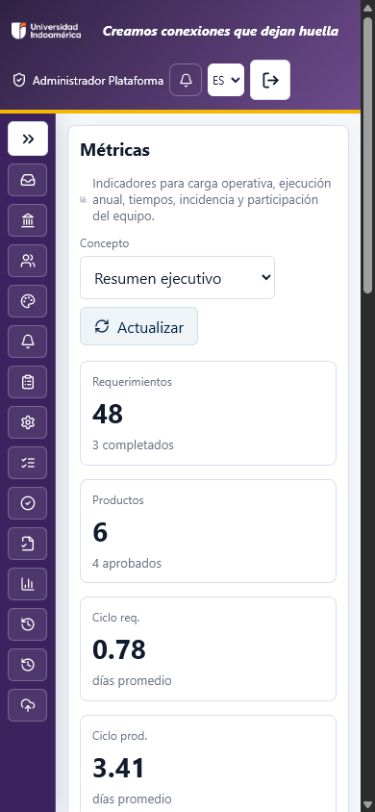

Los indicadores y gráficos se apilan verticalmente. Esta distribución evita reducir en exceso el contenido y permite recorrer la historia de las métricas mediante desplazamiento vertical.

### 22.5 Recomendaciones operativas

1. Use orientación vertical para captura, consulta y aprobación rápida.
2. Use orientación horizontal o escritorio para tablas extensas, carga inicial y configuración avanzada.
3. No cierre el navegador mientras se carga un adjunto.
4. Confirme el mensaje de éxito antes de abandonar un formulario.
5. Si cambia la orientación del dispositivo, espere a que la pantalla termine de reorganizarse antes de continuar.
