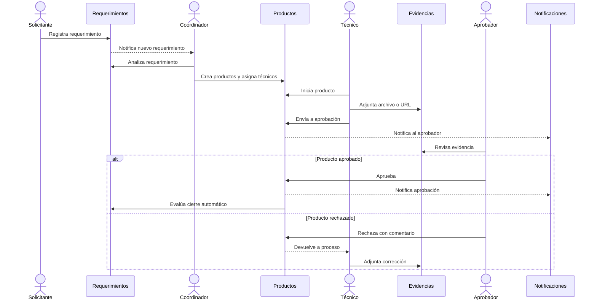
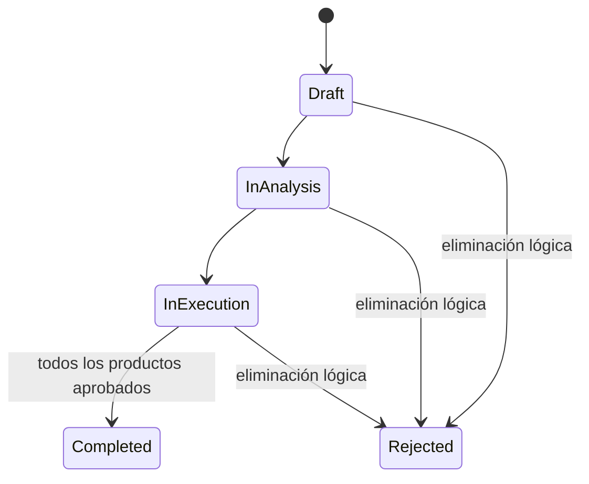
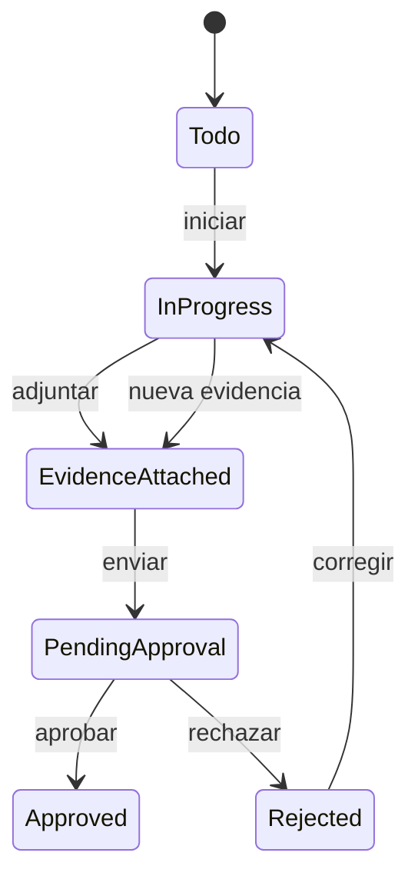

# Especificación funcional - App Tráfico MKT

## 1. Propósito

Centralizar la recepción, planificación, ejecución, aprobación y medición de requerimientos de marketing y comunicación de la Universidad Indoamérica, con seguridad por roles, trazabilidad completa y evidencias verificables.

## 2. Actores

| Actor | Responsabilidad |
| --- | --- |
| Solicitante externo | Registra requerimientos sin autenticación. |
| Solicitante interno | Registra y consulta requerimientos asociados. |
| Técnico | Ejecuta productos asignados, adjunta evidencia y envía a aprobación. |
| Aprobador | Revisa producto/evidencia y aprueba o rechaza. |
| Coordinador | Supervisa requerimientos, productos y aprobaciones. |
| Administrador | Configura seguridad, catálogos, marca, storage, cargas y notificaciones. |
| Auditor | Consulta tracking y métricas. |

## 3. Alcance funcional

| Código | Módulo | Capacidades |
| --- | --- | --- |
| RF-01 | Acceso | Login local, Office 365 configurable y recuperación de clave. |
| RF-02 | Requerimientos | Creación pública/interna, edición, estados, filtros y eliminación lógica. |
| RF-03 | Productos | Asignación técnica, catálogos, secuencial, workflow y versiones. |
| RF-04 | Adjuntos | Archivo/URL, 50 MB, preview, agrupación y eliminación lógica. |
| RF-05 | Aprobaciones | Consulta, adjuntos, aprobación, rechazo, comentarios y tracking. |
| RF-06 | Administración | Facultades, carreras, sedes, aprobadores y catálogos. |
| RF-07 | Seguridad | Usuarios, roles, pantallas, proveedor de acceso y menú. |
| RF-08 | Configuración | Marca, almacenamiento, notificaciones y carga inicial. |
| RF-09 | Seguimiento | Auditoría JSON, notificaciones internas y confirmación de recibido. |
| RF-10 | Analítica | Carga, tiempos, incidencia, participación y usabilidad. |

## 4. Proceso de negocio

## 5. Estados y reglas

### Requerimiento

Reglas:

1. Crear un producto lleva el requerimiento a análisis.
2. Iniciar un producto lleva el requerimiento a ejecución.
3. Un producto rechazado mantiene abierto el requerimiento.
4. Solo la aprobación de todos los productos permite completar el requerimiento.
5. La eliminación lógica conserva auditoría y finaliza como rechazado.

### Producto

Reglas:

1. El responsable debe ser usuario activo con rol Técnico.
2. No se puede enviar a aprobación sin evidencia.
3. Un segundo clic en una acción completada permanece deshabilitado.
4. Cada envío genera una versión histórica.
5. Rechazar no elimina versiones ni adjuntos previos.

## 6. Seguridad y visibilidad

- JWT para sesiones locales.
- Microsoft Entra ID preparado para SSO organizacional.
- Usuarios inactivos no pueden autenticarse.
- La desactivación se bloquea si existen asignaciones activas.
- Las pantallas visibles se obtienen por rol y pueden ajustarse por usuario.
- Administrador y Coordinador ven el universo operativo.
- Técnico ve productos asignados y requerimientos relacionados.
- Aprobador ve productos pendientes de decisión.
- Office 365 puede ocultarse globalmente en Manejo Marca y habilitarse por usuario.

## 7. Pantallas funcionales

### Acceso y captura pública

### Operación

### Control y decisión

### Administración

## 8. Auditoría

Toda acción relevante registra:

- Entidad e identificador.
- Fecha UTC.
- Usuario.
- Acción y descripción.
- Estado anterior y posterior.
- Cadena JSON con contexto del evento.

Fuentes principales:

- `RequirementAuditEvents`.
- `ActivityAuditEvents`.
- `ApprovalAuditEvents`.
- Registros de notificaciones y confirmaciones.

## 9. Integraciones

| Integración | Uso | Configuración |
| --- | --- | --- |
| Microsoft Entra ID | SSO Office 365 | Tenant, Client ID, secreto y redirect URI. |
| Power Automate | Correo, Teams y retorno de aprobación | Webhook y plantilla HTML. |
| Storage local | Evidencias en desarrollo | Volumen Docker. |
| Azure Blob | Evidencias cloud | Connection string y container. |
| FTP | Evidencias externas | Host y credenciales. |
| Power BI | Analítica ejecutiva | Conexión SQL Server/PBIR. |

## 10. Criterios de aceptación transversales

1. Crear o editar cierra el popup y refresca el detalle.
2. Toda acción exitosa o fallida muestra un toast.
3. Los formularios validan correo, URL, fechas, formatos y campos obligatorios.
4. Los grids ofrecen búsqueda con resaltado y paginación.
5. Las eliminaciones son lógicas y solicitan confirmación.
6. Las acciones respetan rol, permisos y estado del workflow.
7. Los cambios relevantes quedan auditados.
