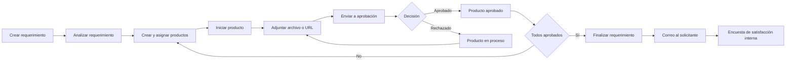
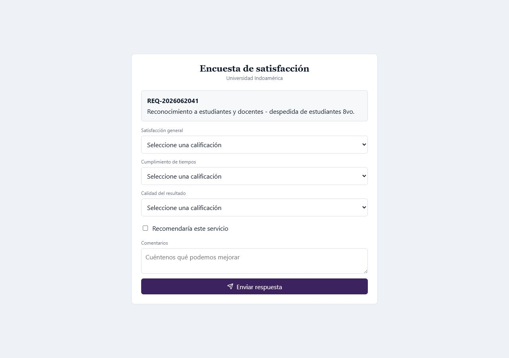

# Manual de usuario - App Tráfico MKT

Este manual explica el uso completo de la plataforma, desde el registro de un requerimiento hasta su cierre, incluyendo productos, evidencias, aprobaciones, auditoría y administración.

## 1. Acceso

Direcciones disponibles:

- Equipo servidor: `https://localhost/login`
- Red interna principal: `https://MarketingIndo/login`
- Red interna secundaria: `https://DESKTOP-Q1VCG41/login`
- Producción prevista: `https://marketingtrafico.indoamerica.edu.ec/login`

1. Ingrese correo y contraseña para autenticación local.
2. Use `Ingresar con Office 365` cuando esté habilitado globalmente y autorizado para su usuario.
3. Use `Recuperar contraseña` si necesita una clave temporal.
4. El Administrador controla desde Manejo Marca si se muestran Office 365, formularios públicos, robot Puma y credenciales de prueba.

### Recuperar contraseña

1. Escriba el correo registrado.
2. Presione `Enviar clave temporal`.
3. Abra `Cambiar clave`, ingrese la clave temporal y defina una nueva.
4. Al finalizar, el sistema regresa al login.

## 2. Perfiles

| Perfil | Pantalla inicial | Información visible |
| --- | --- | --- |
| Administrador | Requerimientos | Todos los módulos y registros. |
| Coordinador | Requerimientos | Todos los requerimientos, productos y aprobaciones. |
| Técnico | Productos | Productos asignados y requerimientos relacionados. |
| Aprobador | Aprobaciones | Productos pendientes de aprobación. |
| Auditor | Auditorías | Seguimiento y métricas permitidas. |
| Solicitante | Requerimientos | Requerimientos relacionados con su usuario. |

## 3. Flujo completo

## 4. Crear un requerimiento sin login

1. Desde el login seleccione `Abrir formulario completo` o el formulario emergente, cuando estén habilitados.
2. Complete actividad, solicitante, facultad, carrera, sede, lugar, fechas, formato y objetivo.
3. Presione `Enviar requerimiento`.
4. El requerimiento queda disponible para Administrador y Coordinador.

## 5. Requerimientos

Ruta: `/dashboard`

### Crear

1. Presione el botón `+` con tooltip `Crear nuevo requerimiento`.
2. Complete los campos del popup.
3. La carrera se filtra de acuerdo con la facultad.
4. Guarde. El popup se cierra y el detalle se actualiza.

### Gestionar

- Use el buscador por código, actividad, solicitante, facultad, carrera, sede o estado.
- Las palabras encontradas se resaltan.
- Use la paginación y seleccione 5, 10, 20 o 50 registros.
- `Ver requerimientos finalizados` cambia la consulta a registros finalizados.
- Las acciones siguen la secuencia análisis, ejecución y finalización.
- Editar y eliminar lógicamente permanecen disponibles según permisos.
- Eliminar un requerimiento finaliza como rechazados sus productos relacionados.

## 6. Productos

Ruta: `/activities`

### Crear y asignar

1. Presione `+`.
2. Seleccione el requerimiento.
3. Revise el ID secuencial sugerido `PROD-####`.
4. Seleccione tipo de requerimiento, público objetivo, tipo de producto, canal y KPI.
5. Seleccione como responsable un usuario activo con rol Técnico.
6. Guarde para cerrar el popup y actualizar el seguimiento.

### Ejecutar el workflow

1. `Iniciar`: cambia el producto a `Producto en proceso` y el requerimiento a ejecución.
2. `Adjuntar`: se habilita después de iniciar.
3. `Enviar a aprobación`: se habilita cuando existe evidencia.
4. `Ver`: consulta datos y adjuntos.
5. `Versiones`: consulta cada envío a aprobación y su decisión.
6. `Editar` y `Eliminar`: modifican o eliminan lógicamente el producto.

Los botones pendientes, disponibles y completados usan los colores parametrizados en Manejo Marca.

### Versiones enviadas

Cada rechazo conserva la versión, fecha, aprobador, comentarios y adjuntos. El producto vuelve a proceso para permitir una corrección y un nuevo envío.

## 7. Adjuntos

Ruta: `/evidence`

1. Presione `+` o use el botón del producto.
2. Seleccione `Subir archivo` para drag and drop, con máximo de 50 MB.
3. Seleccione `Ingresar URL` para videos o archivos pesados alojados externamente.
4. Registre quién adjunta la evidencia.
5. Confirme la carga.

Los productos se muestran como cabecera y sus adjuntos permanecen colapsados. Al desplegar se puede previsualizar, abrir o eliminar lógicamente cada evidencia.

## 8. Aprobaciones

Ruta: `/approvals`

1. El Aprobador visualiza productos pendientes; el Coordinador también puede consultarlos.
2. Busque por producto, responsable, tipo, canal, KPI u objetivo.
3. Abra los adjuntos y revise su contenido.
4. Presione aprobar o rechazar.
5. Registre comentarios para conservar la trazabilidad.

- Una aprobación finaliza el producto.
- Un rechazo lo devuelve a `Producto en proceso`.
- El requerimiento solo se completa cuando todos sus productos están aprobados.
- `Ver productos aprobados` cambia la bandeja a registros resueltos.

### Cierre y encuesta de satisfacción

Cuando todos los productos quedan aprobados, el sistema completa el requerimiento y ejecuta automáticamente el siguiente proceso:

1. Registra el cambio a `Completado` en la auditoría del requerimiento.
2. Crea una notificación de tipo `RequirementCompleted` dirigida al correo del solicitante.
3. Envía a Power Automate el asunto, mensaje, destinatario y contenido HTML.
4. El correo muestra el botón `Completar encuesta de satisfacción`.
5. El botón abre una página de App Tráfico MKT; no dirige a formularios externos.

La encuesta solicita:

- Satisfacción general, de 1 a 5.
- Cumplimiento de tiempos, de 1 a 5.
- Calidad del resultado, de 1 a 5.
- Confirmación de si recomendaría el servicio.
- Comentarios opcionales, hasta 2.000 caracteres.

El enlace no requiere login porque está protegido por un token firmado asociado al requerimiento. Solo funciona cuando el requerimiento está completado y permite una única respuesta. Un segundo intento informa que la encuesta ya fue registrada.

## 9. Métricas

Ruta: `/metrics`

Seleccione el concepto requerido:

- Resumen ejecutivo.
- Carga operativa.
- Proyectos ejecutados.
- Tiempos y esfuerzo.
- Incidencia institucional.
- Participación por áreas.
- Usabilidad por usuario.

Las métricas usan requerimientos, productos, aprobaciones y auditoría para apoyar decisiones de capacidad y cumplimiento.

## 10. Auditorías

Ruta: `/audit`

1. Seleccione la fuente: requerimientos, productos o aprobaciones.
2. Busque por acción, usuario, estado o decisión.
3. Revise fecha, responsable, transición, descripción y JSON técnico.
4. Use la información para reconstruir el ciclo completo del registro.

## 11. Catálogos

Ruta: `/admin`

Las opciones horizontales permiten administrar Facultades, Carreras, Sedes, Aprobadores, estados, formatos, tipos de producto/requerimiento, públicos, canales y KPI.

1. Seleccione el catálogo.
2. Revise primero los registros existentes.
3. Presione `+` para abrir el popup correspondiente.
4. Cree o edite código, nombre, relaciones y estado.
5. Use eliminación lógica para conservar integridad histórica.

Las carreras deben relacionarse con su facultad. Los catálogos utilizados en requerimientos y productos se guardan mediante claves foráneas.

## 12. Usuarios, roles y permisos

Ruta: `/users`

1. Presione `+`.
2. Registre nombre, correo y credenciales.
3. Asigne uno o varios roles.
4. Revise las pantallas visibles derivadas del rol.
5. Active o bloquee Office 365 para el usuario.
6. Defina menú horizontal o vertical.
7. Guarde.

Por defecto se muestran usuarios activos. `Ver inactivos` muestra únicamente inactivos. No se permite inactivar un usuario con requerimientos o productos activos asignados.

## 13. Almacenamiento

Ruta: `/storage`

- `Local`: ruta dentro del volumen Docker.
- `Blob`: cadena de conexión y contenedor Azure.
- `FTP`: host, usuario y contraseña.
- Los campos cambian según el proveedor elegido.
- Solo una configuración activa debe dirigir las cargas del ambiente.

## 14. Carga inicial

Ruta: `/initial-import`

1. Seleccione carga completa, administración, catálogos, usuarios, requerimientos o productos.
2. Descargue la plantilla específica.
3. Complete el Excel conservando nombres de hojas y columnas.
4. Abra el popup y arrastre el archivo `.xlsx` de hasta 50 MB.
5. Ejecute la carga y revise el tracking de fechas, cantidades y resultado.

## 15. Manejo Marca

Ruta: `/branding`

Cada categoría abre su propio popup:

- Textos.
- Colores.
- Botones y estados.
- Tipografía.
- Cabecera y menú.
- Logo e imágenes.
- Login público.

En `Login público` se controla de forma independiente:

- Crear requerimiento sin login.
- Formulario público completo.
- Robot Puma.
- Credenciales de prueba.
- Ingreso con Office 365.

## 16. Configuración de notificaciones

Ruta: `/notifications`

1. Presione `+`.
2. Configure correo y destinatarios.
3. Configure Teams y el canal.
4. Ingrese el webhook de Power Automate.
5. Edite la plantilla HTML y revise el preview.
6. Active la configuración y guarde.

## 17. Mis notificaciones

Ruta: `/my-notifications`

- Muestra notificaciones del usuario autenticado.
- Permite buscar y resaltar coincidencias.
- La acción de recibido registra usuario y fecha.

## 18. Registro de notificaciones

Ruta: `/notification-log`

Solo el Administrador consulta el histórico de eventos, destinatarios, mensajes, fechas y confirmaciones de recibido.

## 19. Buenas prácticas operativas

- No comparta contraseñas ni tokens.
- No elimine catálogos que ya estén relacionados; use inactivación lógica.
- Verifique el producto y adjuntos antes de enviar a aprobación.
- Registre comentarios claros al rechazar.
- Mantenga los responsables y aprobadores activos y actualizados.
- Use URL para archivos muy pesados y archivo directo para evidencias que deban conservarse localmente.
- Registre siempre un correo válido en `Correo del solicitante`; ese dato recibe la notificación de cierre y la encuesta.
