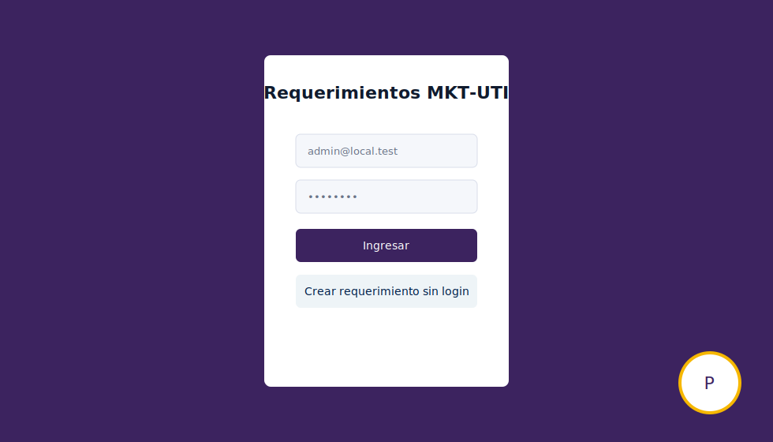
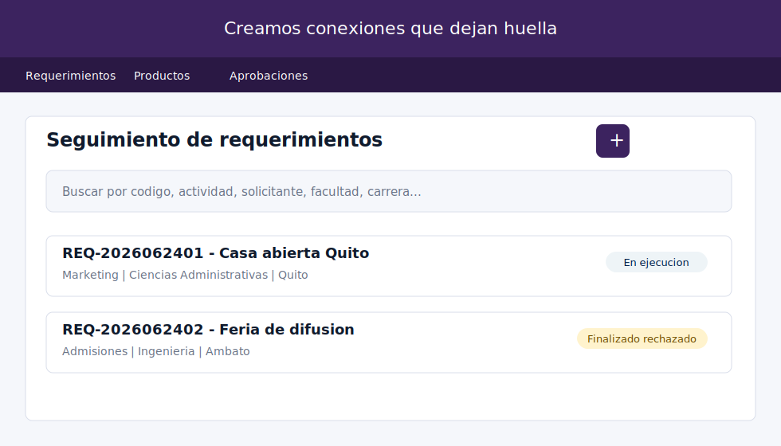
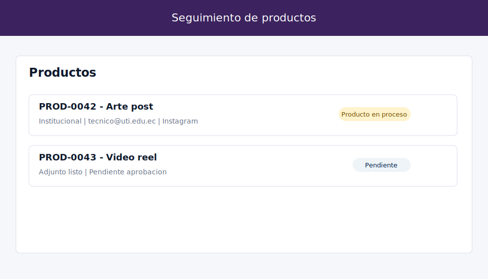
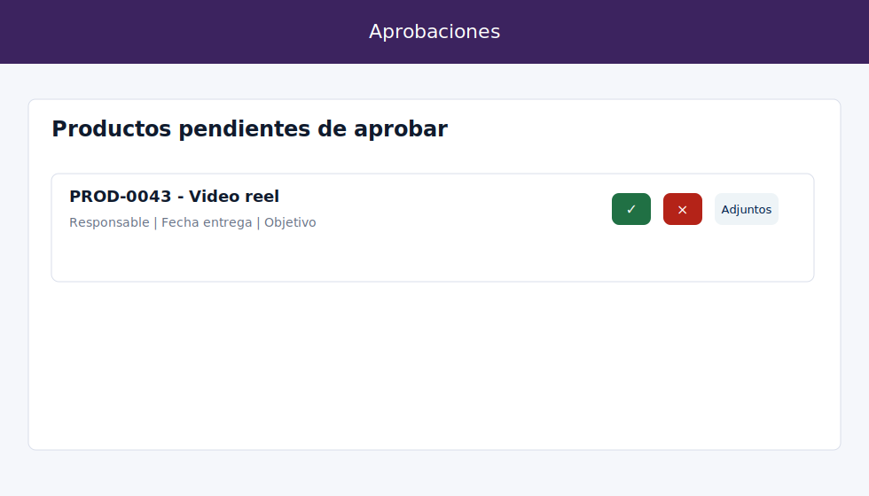
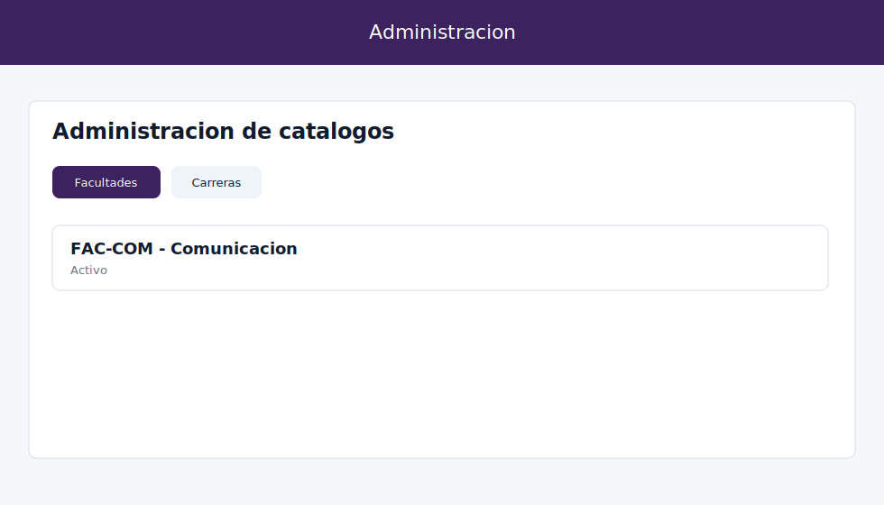

# Guía funcional de usuario

Esta guía describe el flujo completo de App Tráfico MKT, las pantallas disponibles y las reglas de operación por perfil.

## Flujo general

1. Un usuario funcional registra un requerimiento desde el formulario público, el asistente Puma o la pantalla interna.
2. El Administrador o Coordinador revisa el requerimiento y crea sus productos.
3. Cada producto se asigna a un usuario con rol Técnico.
4. El Técnico inicia el producto, agrega uno o más adjuntos y lo envía a aprobación.
5. El Aprobador consulta los datos y adjuntos, y aprueba o rechaza.
6. Un rechazo devuelve el producto a `Producto en proceso`, conserva la versión enviada y permite corregir y reenviar.
7. El requerimiento finaliza únicamente cuando todos sus productos están aprobados.
8. Cada acción genera trazabilidad y puede generar notificaciones internas, por correo o Teams.

## Perfiles y pantalla inicial

| Perfil | Pantalla inicial | Alcance |
| --- | --- | --- |
| Administrador | Requerimientos | Consulta todo y administra seguridad, catálogos y configuración. |
| Coordinador | Requerimientos | Consulta todos los requerimientos, productos y aprobaciones. |
| Técnico | Productos | Consulta y gestiona únicamente los productos asignados. |
| Aprobador | Aprobaciones | Consulta productos pendientes de decisión. |
| Auditor | Auditorías | Consulta trazabilidad y métricas según permisos. |
| Solicitante | Requerimientos | Consulta los requerimientos asociados a su usuario. |

## Inicio de sesión y registro público

Ruta: `/login`

- Permite autenticación local y Microsoft Office 365.
- `Manejo Marca > Login público` controla por separado el formulario emergente, el formulario completo, el asistente Puma y la visualización de credenciales de prueba.
- El formulario y el asistente crean requerimientos sin iniciar sesión.
- `Recuperar contraseña` envía una clave temporal; al cambiarla, el sistema vuelve al login.
- El cierre de sesión limpia la sesión sin mostrar una alerta de sesión vencida.

## Requerimientos

Ruta: `/dashboard`

1. Presionar `+` para abrir el formulario.
2. Completar actividad o evento, solicitante, facultad, carrera, sede, lugar, fechas, objetivo y formato.
3. Guardar; el popup se cierra y el seguimiento se actualiza.
4. Crear los productos relacionados.

El buscador filtra por contenido y marca las palabras encontradas. Por defecto se muestran registros abiertos; `Ver finalizados` muestra únicamente los finalizados. El Técnico solo ve requerimientos relacionados con productos asignados; Administrador y Coordinador ven todos.

## Productos

Ruta: `/activities`

1. Presionar `+`, elegir requerimiento y conservar o ajustar el código secuencial sugerido.
2. Seleccionar los catálogos y un responsable activo con rol Técnico.
3. Ejecutar en orden `Iniciar`, `Adjuntar` y `Enviar a aprobación`.
4. Consultar las versiones enviadas, editar datos o eliminar lógicamente.

Al adjuntar se puede `Subir archivo` de hasta 50 MB o `Ingresar URL` para contenido pesado. El detalle de adjuntos se abre plegado por defecto; cada elemento puede desplegarse, visualizarse o eliminarse. El buscador admite varias palabras y resalta cada coincidencia.

## Adjuntos

Ruta: `/evidence`

- Presenta una cabecera resumen y una fila plegable por producto.
- El botón `+` permite subir un archivo o registrar una URL externa.
- Una URL queda vinculada al producto y participa en el mismo flujo de aprobación.
- Los permisos y filtros respetan el usuario autenticado.
- La eliminación es lógica y solicita confirmación.

## Aprobaciones

Ruta: `/approvals`

- Muestra pendientes o, mediante el check, productos ya aprobados.
- El buscador revisa producto, responsable, tipo, canal, KPI, objetivo y estado, y marca las coincidencias.
- `Ver adjuntos` abre imágenes, PDF o enlaces externos.
- `Aprobar` y `Rechazar` registran responsable, fecha y comentarios.
- Un rechazo conserva la versión histórica y devuelve el producto a proceso.

## Administración de catálogos

Ruta: `/admin`

Administra Facultades, Sedes, Carreras por facultad, Aprobadores, estados, tipos de requerimiento y producto, público objetivo, canales, KPI y demás parametrizaciones. Cada opción presenta primero su detalle y usa `+` para crear en popup. Los catálogos se relacionan mediante claves foráneas con requerimientos y productos.

## Usuarios y seguridad

Ruta: `/users`

- Crea y edita nombre, correo, rol, pantallas visibles y preferencias de menú.
- Habilita o bloquea el acceso con Office 365 por usuario.
- Por defecto muestra activos; `Ver inactivos` muestra únicamente inactivos.
- No permite inactivar usuarios con requerimientos o productos activos asignados.
- Los cambios de rol y permisos se aplican en el siguiente inicio de sesión.

## Archivos

Ruta: `/storage`

Configura almacenamiento Local, Azure Blob o FTP. Los campos cambian según el proveedor. El buscador filtra y resalta nombre, proveedor, ruta, contenedor, host y estado. En producción puede habilitarse el proveedor cloud.

## Carga inicial

Ruta: `/initial-import`

Permite descargar y cargar plantillas independientes para administración, catálogos, usuarios, requerimientos, productos o una carga completa. El popup se cierra al finalizar y el detalle registra archivo, alcance, fechas, cantidades y resultado.

## Manejo Marca

Ruta: `/branding`

Las categorías `Textos`, `Colores`, `Botones`, `Tipografía`, `Cabecera y menú`, `Logo e imágenes` y `Login público` se abren en popups independientes. `Login público` permite mostrar u ocultar las credenciales de prueba, los dos formularios públicos y el asistente Puma. Los valores se guardan globalmente en SQL Server.

## Notificaciones

Ruta: `/notifications`

- Configura correo, Teams, webhook de Power Automate y plantilla HTML con vista previa.
- El buscador filtra nombre, destinatario, canal, webhook y estado, y resalta coincidencias.
- `Mis notificaciones` muestra la bandeja del usuario, permite buscar y marcar como recibida.
- `Registro notificaciones` permite al Administrador revisar los envíos realizados.

## Métricas

Ruta: `/metrics`

Agrupa resumen ejecutivo, carga operativa, tiempos y esfuerzo, incidencia institucional, participación por áreas y usabilidad por usuario. Los datos se derivan de requerimientos, productos, aprobaciones y auditorías.

## Auditorías

Ruta: `/audit`

Permite consultar eventos de requerimientos, productos y aprobaciones. Cada registro conserva fecha, usuario, acción, descripción y cadena JSON para reconstruir el proceso completo.

## Comportamiento común

- Los grids tienen búsqueda, paginación y selector de cantidad por página cuando corresponde.
- Las coincidencias se resaltan visualmente en los buscadores.
- Crear, editar, eliminar, aprobar y adjuntar muestran un mensaje tipo globo.
- Los formularios en popup se cierran después de guardar y actualizan el detalle.
- Las acciones usan iconos y tooltips; los botones de flujo se habilitan en secuencia.
- La visibilidad del menú se determina por rol y permisos de pantalla.

## Direcciones de acceso

| Entorno | Dirección |
| --- | --- |
| Local HTTP | `http://localhost:3000/login` |
| Local HTTPS por Nginx | `https://localhost/login` |
| Internet temporal | URL `trycloudflare.com` informada al iniciar el túnel rápido. |
| Internet estable | Dominio propio asociado a un Cloudflare Named Tunnel. |

Las direcciones `trycloudflare.com` no son permanentes. Para una URL fija se debe crear el túnel nombrado en la cuenta Cloudflare, asociar un hostname y colocar el archivo de credenciales en `deploy/cloudflared/`; el repositorio incluye la configuración base para ese despliegue.
