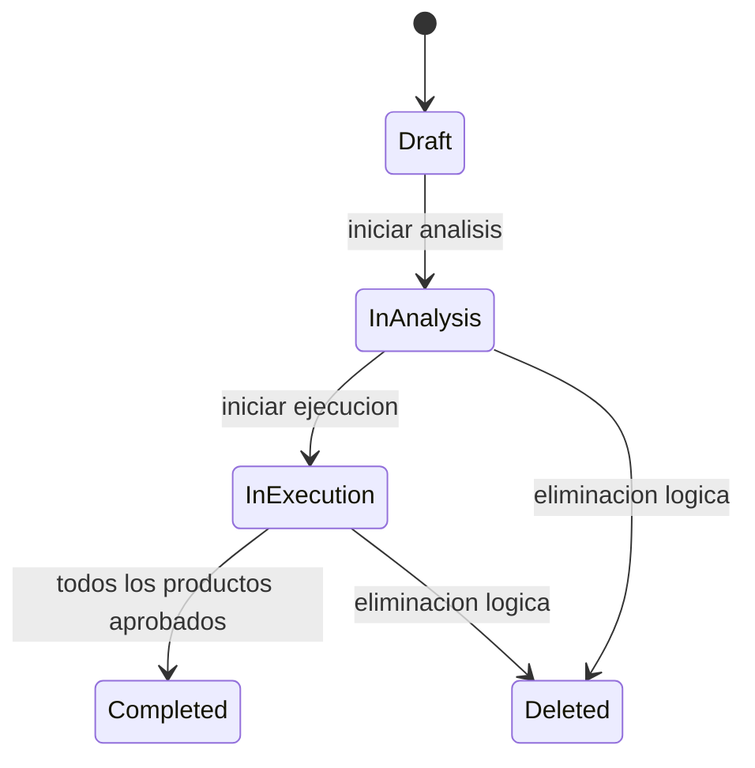
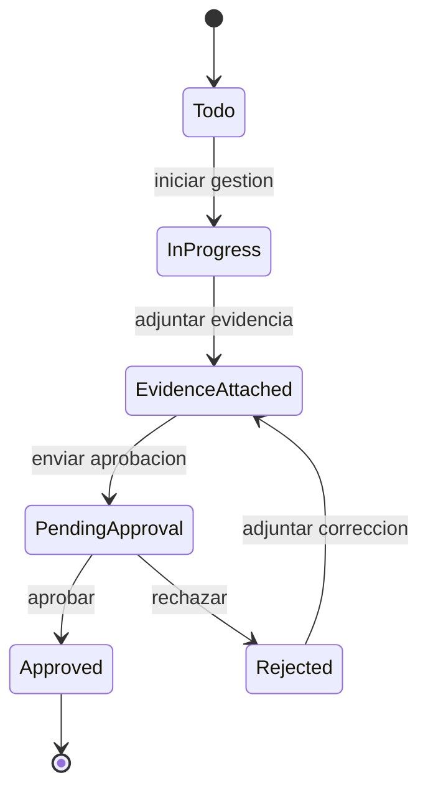

# Arquitectura tecnica

## Objetivo

App Trafico MKT es una plataforma para gestionar requerimientos de marketing/comunicacion, asignar productos al equipo tecnico, registrar evidencias, aprobar actividades y consolidar metricas/auditorias.

## Stack

- Backend: C# .NET Minimal APIs.
- Frontend: Next.js con React.
- Base de datos: SQL Server.
- Proxy: Nginx.
- Contenedores: Docker Compose.
- Autenticacion: JWT local y Microsoft Entra ID preparado.
- Notificaciones: Power Automate via webhook.
- Archivos: Local por defecto, con parametrizacion para Blob Storage o FTP.

## Microservicios

| Servicio | Ruta local | Responsabilidad |
| --- | --- | --- |
| Requirements API | `http://localhost:5101` | Requerimientos, workflow, metricas y auditoria. |
| Activities API | `http://localhost:5102` | Productos, workflow, notificaciones, auditoria y sincronizacion con requerimientos. |
| Evidence API | `http://localhost:5103` | Adjuntos, almacenamiento, aprobaciones y auditoria de aprobaciones. |
| Identity API | `http://localhost:5104` | Login, JWT, usuarios, roles, permisos, marca y SSO. |
| Administration API | `http://localhost:5105` | Catalogos, facultades, sedes, carreras, aprobadores y carga inicial. |

## Bases logicas

- `RequirementsDb`
- `ActivitiesDb`
- `EvidenceDb`
- `IdentityDb`
- `AdministrationDb`

Todas viven en SQL Server local dentro de Docker Compose. Cada servicio aplica su `EnsureSchema` para evolucionar columnas necesarias sin depender de migraciones manuales en desarrollo.

## Seguridad

- Login local con JWT.
- Roles: `Administrador`, `Coordinador`, `Solicitante`, `Tecnico`, `Aprobador`, `Auditor`.
- Cada usuario tiene pantallas visibles configurables.
- El menu horizontal/vertical puede configurarse por usuario.
- Usuarios inactivos no pueden autenticarse.
- Microsoft SSO se controla con `AllowMicrosoftLogin` por usuario.
- La visibilidad global del botón Office 365 se controla con `ShowOffice365Login` en `BrandSettings`.
- La sesión se almacena en el navegador con expiración JWT y cierre explícito silencioso.

## Workflows principales

### Requerimiento

### Producto

## Auditoria

La aplicacion registra auditoria en tres fuentes:

- `RequirementAuditEvents`: cambios de requerimientos.
- `ActivityAuditEvents`: cambios de productos.
- `ApprovalAuditEvents`: aprobaciones/rechazos.

La pantalla `/audit` consolida las tres fuentes y permite filtrar por tipo de tracking.

## Integraciones externas

### Microsoft Entra ID

Variables esperadas:

- `AzureAd__TenantId`
- `AzureAd__ClientId`
- `AzureAd__ClientSecret`
- `AzureAd__AllowedDomain`

### Power Automate

El servicio de productos envia un payload HTTP cuando se aprueba un producto. El flujo puede enviar correo HTML y mensaje a Teams.

### Storage

Provider soportados:

- `Local`
- `Blob`
- `FTP`

En local se usa `/app/uploads` con volumen Docker.

Los adjuntos aceptan dos orígenes:

- Archivo multipart de hasta 50 MB.
- URL HTTPS registrada como evidencia externa.

## Entrada HTTP/HTTPS

Nginx publica frontend y APIs con resolución DNS dinámica de Docker:

| Prefijo público | Destino |
| --- | --- |
| `/` | Next.js |
| `/api/auth`, `/api/identity` | Identity API |
| `/api/requirements` | Requirements API |
| `/api/activities`, `/api/notification-settings` | Activities API |
| `/api/evidence`, `/api/approvals`, `/api/storage-settings`, `/api/files` | Evidence API |
| `/api/admin` | Administration API |

Nombres internos admitidos: `MarketingIndo`, `DESKTOP-Q1VCG41`, `localhost` y `172.20.20.66`. La CSP permite `frame-ancestors` de Teams y Microsoft 365.

## Persistencia y evolución

Cada servicio ejecuta una rutina idempotente de esquema al iniciar. Estas rutinas:

- Crean tablas faltantes.
- Agregan columnas nuevas con valores predeterminados.
- Conservan datos existentes.
- Inicializan catálogos y configuraciones mínimas.

En producción se recomienda reemplazar este mecanismo por migraciones versionadas y aprobadas por ambiente.

## Observabilidad y continuidad

- Cada API expone `/health`.
- SQL Server tiene healthcheck Docker.
- Todos los servicios usan `restart: unless-stopped`.
- Nginx resuelve nuevamente las IP internas cuando Docker recrea servicios.
- Auditoría funcional y logs de contenedor permiten investigar fallas.
- El túnel rápido es temporal; producción debe usar Cloudflare Named Tunnel.

## Pipelines

GitHub Actions contiene:

- `ci.yml`: build/test para PRs y ramas feature/hotfix.
- `deploy-dev.yml`: despliegue desde `develop`.
- `deploy-test.yml`: despliegue desde `test`.
- `deploy-prod.yml`: despliegue desde `main`.

Para activar despliegues reales configurar environments `dev`, `test` y `prod` con:

- Variable `DEPLOY_ENABLED=true`
- Variable `DEPLOY_PATH`
- Secret `DEPLOY_HOST`
- Secret `DEPLOY_USER`
- Secret `DEPLOY_SSH_KEY`

